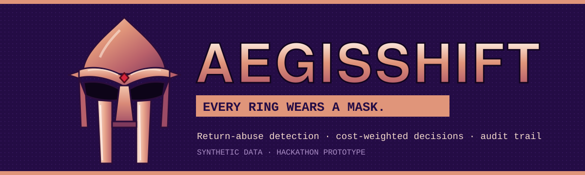
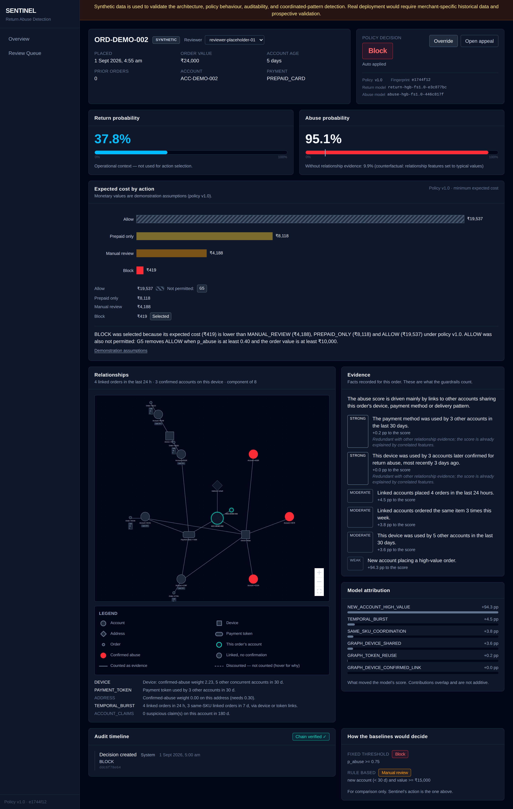
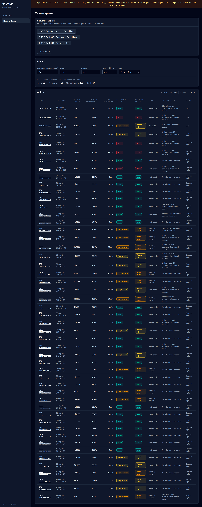

<p align="center">
  
</p>

<p align="center">
  <a href="https://sajid1108.github.io/aegisshift/"></a>
  
  
</p>

<p align="center">
  
  
  
  
  
  
  
</p>

---

## 🎭 THE ORIGIN STORY

Return abuse rarely comes from one customer. It comes from **rings**: a handful of accounts that look clean one by one but share the same phones, cards and addresses. Every ring wears a mask.

**AegisShift** takes the mask off. At checkout it scores each order, looks at who the account is connected to, and picks the **cheapest fair response**: let it through, ask for prepayment, send it to a person, or block it. Every decision is written down, and nobody can quietly change it later.

> **A prediction is not a decision.** The models give probabilities. A separate policy decides, by cost, under rules it can't break.

---

## 🔩 OPERATION: CHECKOUT

```
  order ──► return model ──► P(return) ─┐
     │                                  ├──► policy engine ──► cheapest allowed action ──► hash-chained audit
     └────► abuse model  ──► P(abuse) ──┘         ▲
              ▲                                   │
     relationship graph                     guardrails remove
  (shared devices, cards, addresses)        actions, never add them
```

| The move | What it means |
|---|---|
| **ALLOW** | The order goes through. |
| **PREPAID_ONLY** | Pay up front; the refund waits for the warehouse check. |
| **MANUAL_REVIEW** | A human reviewer decides. |
| **BLOCK** | Stopped. Needs p ≥ 0.70 **and** two corroborating signals, anchored on a device, a payment token or account claims. |

---

## 🍲 MM.. NUMBERS

Measured on the held-out test set of the synthetic world.

| | With the graph | Without it |
|---|:---:|:---:|
| **Abuse PR-AUC** | **0.814** | 0.527 |
| **Recall on rings never seen in training** | **72.7%** | 14.3% |

**Genuine customers blocked** in the hard-negative cohorts (households, hostels, refurbished phones): **0.0%**.

Three demo orders, three outcomes:

| Demo | Who | Decision | Why |
|---|---|---|---|
| 1 | A frequent returner with years of clean history | **ALLOW** | Returning a lot is not abuse. |
| 2 | A new account tied into a ring | **BLOCK** | Scores 95% with the graph evidence, 10% without it. The graph catches it; the new account makes it urgent. |
| 3 | Somewhere in the middle | **MANUAL_REVIEW** | At 69% risk, a human review costs less than a wrong block. |

---

## 🩸 THE VILLAIN'S CONFESSION

A good villain tells you the plan. These results stay in, on purpose:

- **A simple tuned threshold is cheaper.** It costs ₹1,60,112 per 1,000 orders; AegisShift costs ₹1,95,313. The gap is the price of the guardrails: they change 49 decisions and refuse 8 blocks that would have hit genuine customers. That's a deliberate trade, not a win on cost.
- **The graph doesn't work alone.** It is what catches Demo 2, but the new-account signal is what makes it urgent.
- **New accounts get more friction.** Accounts under 30 days old see friction on 36.1% of orders against 4.8–5.9% for older ones. The [model card](docs/MODEL_CARD.md) says so plainly.

---

## 🖼️ THE SCREENS

| The reviewer's view of the ring | The review queue |
|---|---|
|  |  |

**Try it without installing anything:** the [live site](https://sajid1108.github.io/aegisshift/) lets you build an order and see what the shopper is told next to what the reviewer sees. Its answers are recorded from the real model, not computed live.

---

## ⚙️ RUN IT YOURSELF

Needs Python 3.12 and Node.js 20+.

```bash
cd backend
py -3.12 -m venv .venv                   # Windows: .venv\Scripts\python.exe
python -m pip install -r requirements.lock
python -m pip install --no-deps -e .

python -m sentinel.cli generate          # the seeded synthetic world
python -m sentinel.cli build-features
python -m sentinel.cli train
python -m sentinel.cli evaluate
python -m sentinel.cli seed-db
python -m sentinel.cli serve             # API on http://127.0.0.1:8000
```

```bash
cd frontend
npm ci
npm run dev                              # http://localhost:5173
```

The frontend proxies the API and adds the internal key server-side, so no key reaches the browser. Open `http://localhost:5173/queue`, press **Simulate checkout**, and follow an order.

**Tests**

```bash
cd backend && python -m pytest tests/ -m "not slow"   # fast loop
cd backend && python -m pytest tests/                 # full suite, before every commit
cd frontend && npm test && npm run build
```

---

## 🧱 UNDER THE MASK

| Layer | Stack |
|---|---|
| Backend | Python 3.12, FastAPI, Pydantic v2, SQLAlchemy 2, SQLite |
| ML | scikit-learn HistGradientBoosting (calibrated), pandas, NetworkX |
| Frontend | React 19, TypeScript, Vite, Tailwind CSS v4, @xyflow/react, Recharts |

- **Point-in-time features:** the model never sees the future, offline or live.
- **Append-only audit:** every decision carries a SHA-256 hash chain, and overrides keep the original recommendation.
- **Outcome-only checkout API:** the shopper never learns why, and ALLOW and MANUAL_REVIEW look identical from outside.

Deep dives: [architecture](docs/ARCHITECTURE.md) · [accepted deviations](docs/DEVIATIONS.md) · [model card](docs/MODEL_CARD.md) · [demo script](docs/DEMO_SCRIPT.md) · [build log](docs/BUILD_LOG.md)

---

## ⚠️ FINE PRINT

> **Synthetic data is used to validate the architecture, policy behaviour, auditability, and coordinated-pattern detection. Real deployment would require merchant-specific historical data and prospective validation.**

- No authentication platform yet (a static internal key)
- No SHAP: attributions come from ablation and a reason-code catalogue
- No Neo4j or GNN: the graph is in-memory NetworkX
- No live retraining (offline CLI only) and no cloud deployment yet
- Money values are demonstration assumptions (policy v1.0)

<p align="center"><sub>The code package and CLI keep the working name <code>sentinel</code>. Built by <a href="https://github.com/sajid1108">Sayed Sajid Ali</a>.</sub></p>
