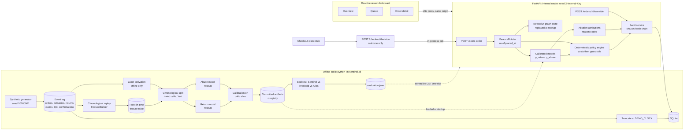

# SENTINEL — FROZEN ARCHITECTURE v1.0

**Status: FROZEN.** This document is the implementation contract. Implement it as written.
Do not rename endpoints, fields, tables, actions, guardrail IDs, reason codes or config keys.
Do not add features, screens, services or dependencies beyond what is listed here.
If something here is ambiguous, contradictory or infeasible: **stop, state the conflict, propose the smallest fix, and wait**. Do not silently redesign.

Save this file in the repository as `docs/ARCHITECTURE.md` and re-read the relevant section before each phase.

## Non-negotiables (quick reference; the details are in the sections below)

1. **Models predict, policy decides.** Models output `p_return` and `p_abuse` only. Never an action. No `/predict` endpoint.
2. **Two separate probabilities.** Never combined into one score, in the backend or the UI.
3. **`p_return` is not an input to action selection.** `action_costs()` has no `p_return` parameter (guardrail G1). A test enforces it.
4. **Actions:** `ALLOW`, `PREPAID_ONLY`, `MANUAL_REVIEW`, `BLOCK`. `PREPAID_ONLY` means prepaid required **and** refund released after warehouse inspection.
5. **Expected cost:** `EC = p·A(a) + (1−p)·G(a) + O(a)`. Friction lives only inside `G(a)`. All numbers come from `config/policy_v1_0.toml`. No money is ever computed or invented in the frontend.
6. **Guardrails only remove actions.** Cost picks the cheapest remaining action. Store both `cost_optimal_action` and `selected_action`. `PREPAID_ONLY` and `MANUAL_REVIEW` are never removed.
7. **BLOCK requires** `p_abuse ≥ 0.70` **and** at least 2 corroborating signals, with at least one of DEVICE, PAYMENT_TOKEN or ACCOUNT_CLAIMS (G2, G3, G4).
8. **Point-in-time features only.** One `FeatureBuilder` code path for training and serving. Chronological event replay: compute features, then add the order's edges. Filter on strict `occurred_at < t0`. Neighbour abuse counts use the **confirmation** time.
9. **Chronological splits:** TRAIN D1–D200, CALIBRATION D231–D275, TEST D306–D365. Manual calibration on the calibration slice: isotonic for return, sigmoid for abuse. No `CalibratedClassifierCV` with random folds.
10. **Fixed `DEMO_CLOCK` = 2026-09-01T10:30:00+05:30.** Never use the wall clock for feature windows.
11. **Synthetic data is deterministic** (seed 20260901) and includes hard negatives: households, offices/hostels, refurbished devices. If test abuse PR-AUC > 0.95, the generator is too easy and must be fixed.
12. **Explanations:** ablation attributions + reason-code templates. **No SHAP, no LLM-generated text.**
13. **Audit:** append-only `audit_events` with SQLite triggers and a SHA-256 hash chain. Overrides need a reason, preserve `recommended_action`, and create a new event.
14. **Customer-facing response** (`/checkout/decision`) carries outcome only. ALLOW and MANUAL_REVIEW return identical bodies. No scores, reasons, thresholds or costs.
15. **Privacy:** identifiers arrive HMAC-hashed (32 hex characters); the API rejects anything else. No IP addresses, names or pincodes as features. The graph UI shows masked labels.
16. **Stack:** Python 3.12, FastAPI, Pydantic v2, SQLAlchemy 2, SQLite, scikit-learn `HistGradientBoostingClassifier`, pandas, NetworkX, joblib. React + TypeScript + Vite + Tailwind v4 + `@xyflow/react` + Recharts. Pin exact versions. The project must run on **Windows** without `make` (`python -m sentinel.cli ...`).
17. **Scope:** 3 frontend routes (Overview, Queue, Order detail). No auth platform, GNN, Neo4j, cloud, retraining or alerting.
18. **Every page shows:** "Synthetic data is used to validate the architecture, policy behaviour, auditability, and coordinated-pattern detection. Real deployment would require merchant-specific historical data and prospective validation."

## If the demo scenarios don't land in their bands

The three demo orders must be scored by the real models. If a demo's `p_abuse` falls outside its test band (§11):
- adjust **that demo account's hand-authored history** or the generator's overlap and noise,
- **never** hard-code probabilities,
- **never** change policy v1.0 values just to force a demo outcome.

Report the change.

## Build order

Follow §12 phase by phase. Stop at the end of each phase, run its checkpoint tests, and report:
- files changed
- test results
- deviations from this document, if any
- open questions

---

# 1. Repository structure

```
sentinel/
├── README.md                      # quickstart, demo script, limitation statement
├── docs/
│   ├── DESIGN.md                  # this pack
│   ├── MODEL_CARD.md              # intended use, data, metrics, limitations
│   └── DEMO_SCRIPT.md             # 4-minute walkthrough + fallback plan
├── backend/
│   ├── pyproject.toml             # Python 3.12, exact pins via uv.lock
│   ├── sentinel/
│   │   ├── cli.py                 # generate | build-features | train | evaluate | seed-db | serve | reset-demo
│   │   ├── settings.py            # DEMO_CLOCK, HMAC secret, INTERNAL_API_KEY, DEMO_MODE
│   │   ├── config/
│   │   │   ├── policy_v1_0.toml   # all monetary assumptions (tomllib, stdlib)
│   │   │   └── reason_codes.toml  # controlled vocabulary
│   │   ├── data/
│   │   │   ├── generator.py       # seeded synthetic world → event log
│   │   │   ├── archetypes.py      # normal, frequent returner, household, office/hostel, refurb, opportunistic, rings
│   │   │   ├── labels.py          # label derivation from events (offline only)
│   │   │   └── demo_orders.py     # 3 deterministic demo requests
│   │   ├── features/
│   │   │   ├── identifiers.py     # normalisation + HMAC, placeholder rejection
│   │   │   ├── graph_state.py     # incremental NetworkX graph, edge reliability, decay
│   │   │   ├── graph_features.py
│   │   │   ├── tabular_features.py
│   │   │   ├── builder.py         # FeatureBuilder: ONE code path for training and serving
│   │   │   └── definitions.py     # feature lists per model + feature_set_version
│   │   ├── models/
│   │   │   ├── train.py           # HistGradientBoostingClassifier × 2
│   │   │   ├── calibrate.py       # manual isotonic / sigmoid on calib slice
│   │   │   ├── attribution.py     # ablation attributions
│   │   │   ├── reason_codes.py    # evidence + attribution → reason codes, templates
│   │   │   └── registry.py        # load, verify sha256 + sklearn version
│   │   ├── policy/
│   │   │   ├── config.py          # typed config + validator (slope-order check)
│   │   │   ├── costs.py           # pure cost function (no p_return argument)
│   │   │   ├── guardrails.py
│   │   │   ├── engine.py          # decide() → PolicyDecision
│   │   │   └── baselines.py       # fixed-threshold + rule-based
│   │   ├── evaluation/
│   │   │   ├── splits.py
│   │   │   ├── metrics.py         # PR-AUC, Brier, ECE, bootstrap CIs
│   │   │   ├── backtest.py        # realized cost, 3 strategies, sensitivity sweep
│   │   │   └── cohorts.py
│   │   ├── db/
│   │   │   ├── schema.sql         # DDL + append-only triggers
│   │   │   ├── models.py          # SQLAlchemy 2.0 mapped classes
│   │   │   └── seed.py            # snapshot truncated at DEMO_CLOCK
│   │   ├── audit/
│   │   │   ├── chain.py           # canonical JSON + sha256 chain + verify
│   │   │   └── service.py
│   │   └── api/
│   │       ├── main.py            # app factory, startup replay, routers
│   │       ├── deps.py            # internal key, reviewer id header, clock
│   │       ├── schemas.py         # Pydantic contracts (§4)
│   │       ├── services/scoring.py
│   │       └── routers/
│   │           ├── internal_scoring.py   # POST /score-order
│   │           ├── internal_orders.py    # GET /orders, GET /orders/{id}, POST override, POST appeal
│   │           ├── internal_audit.py     # GET /audit-events, GET /audit-events/verify
│   │           ├── internal_metrics.py   # GET /metrics
│   │           ├── public_checkout.py    # POST /checkout/decision (outcome only)
│   │           └── demo.py               # POST /demo/reset (DEMO_MODE only)
│   ├── artifacts/                 # COMMITTED: models/*.joblib, model_registry.json, reports/evaluation.json
│   ├── data/                      # generated, git-ignored: events.parquet, features.parquet, sentinel.db
│   └── tests/
│       ├── unit/  (policy, guardrails, costs, chain, identifiers, reason codes)
│       ├── leakage/
│       ├── model/
│       ├── api/
│       └── scenarios/  (demo outcome bands)
└── frontend/
    ├── package.json               # vite, react, typescript, tailwindcss v4, @xyflow/react, recharts
    ├── vite.config.ts             # /api proxy → 127.0.0.1:8000
    └── src/
        ├── api/{client.ts,types.ts}          # types generated from FastAPI OpenAPI (openapi-typescript)
        ├── lib/format.ts                      # never formats money; renders server strings
        ├── components/
        │   ├── SyntheticDataBanner.tsx
        │   ├── ScorePair.tsx                  # two separate probability cards
        │   ├── PolicyDecisionCard.tsx
        │   ├── CostComparison.tsx             # Recharts horizontal bars
        │   ├── RelationshipGraph.tsx          # React Flow, fixed positions from API
        │   ├── ReasonList.tsx
        │   ├── AuditTimeline.tsx
        │   ├── BaselineComparison.tsx
        │   ├── OverrideDialog.tsx
        │   └── ActionBadge.tsx
        └── pages/
            ├── OverviewPage.tsx               # activity + backtest (clearly separated)
            ├── QueuePage.tsx
            └── OrderDetailPage.tsx            # the demo screen
```

Three routes only. The "Simulate checkout" panel (three preset buttons) lives on the Queue page.

---

# 2. Architecture



**Trust boundaries**
- There is no `/predict` endpoint. Models run in-process, behind the policy engine.
- `/checkout/decision` is the only public route. Its response model allows a closed set of fields, with no numbers and no reasons.
- Every internal route requires `X-Internal-Key`. The reviewer identity is a placeholder header, `X-Reviewer-Id`.

---

# 3. Database schema (SQLite)

Design rule: **outcomes are timestamped events, not columns on the order.** Serving code can only reach an outcome through a `occurred_at < t₀` filter.

```sql
PRAGMA foreign_keys = ON;
PRAGMA journal_mode = WAL;

-- ── World (synthetic, truncated at DEMO_CLOCK) ─────────────────────────────
CREATE TABLE accounts (
  account_id   TEXT PRIMARY KEY,
  created_at   TEXT NOT NULL,                       -- ISO-8601 UTC
  source       TEXT NOT NULL CHECK (source IN ('SYNTHETIC','DEMO'))
);

CREATE TABLE identifiers (
  identifier_id        TEXT PRIMARY KEY CHECK (length(identifier_id) = 32),  -- HMAC hex prefix
  kind                 TEXT NOT NULL CHECK (kind IN ('DEVICE','ADDRESS','PAYMENT_TOKEN')),
  is_multi_tenant      INTEGER NOT NULL DEFAULT 0,  -- ADDRESS: office / hostel / PG
  multi_tenant_set_at  TEXT,                        -- point-in-time: only trusted if < t0
  display_label        TEXT NOT NULL                -- masked, e.g. 'Device ••7f3a'
);

CREATE TABLE orders (
  order_id                 TEXT PRIMARY KEY,
  account_id               TEXT NOT NULL REFERENCES accounts(account_id),
  placed_at                TEXT NOT NULL,           -- = prediction time t0
  order_value_inr          REAL NOT NULL CHECK (order_value_inr > 0),
  discount_pct             REAL NOT NULL CHECK (discount_pct BETWEEN 0 AND 90),
  n_items                  INTEGER NOT NULL CHECK (n_items >= 1),
  n_variants_same_product  INTEGER NOT NULL,        -- size bracketing
  primary_category         TEXT NOT NULL,
  delivery_speed           TEXT NOT NULL CHECK (delivery_speed IN ('STANDARD','EXPRESS')),
  payment_method           TEXT NOT NULL CHECK (payment_method IN ('PREPAID_CARD','PREPAID_UPI','COD')),
  device_id                TEXT NOT NULL REFERENCES identifiers(identifier_id),
  address_id               TEXT NOT NULL REFERENCES identifiers(identifier_id),
  payment_token_id         TEXT REFERENCES identifiers(identifier_id),
  source                   TEXT NOT NULL CHECK (source IN ('HISTORY','DEMO','LIVE')),
  split                    TEXT CHECK (split IN ('TRAIN','GAP','CALIBRATION','TEST','RECENT')),
  CHECK ((payment_method = 'COD') = (payment_token_id IS NULL))
);
CREATE INDEX ix_orders_account_time ON orders(account_id, placed_at);
CREATE INDEX ix_orders_device_time  ON orders(device_id, placed_at);
CREATE INDEX ix_orders_token_time   ON orders(payment_token_id, placed_at);
CREATE INDEX ix_orders_address_time ON orders(address_id, placed_at);

CREATE TABLE order_lines (
  order_id     TEXT NOT NULL REFERENCES orders(order_id),
  line_no      INTEGER NOT NULL,
  sku_id       TEXT NOT NULL,
  product_id   TEXT NOT NULL,
  variant      TEXT NOT NULL,
  category     TEXT NOT NULL,
  unit_price_inr REAL NOT NULL,
  quantity     INTEGER NOT NULL,
  PRIMARY KEY (order_id, line_no)
);

CREATE TABLE order_events (
  event_id        INTEGER PRIMARY KEY,
  order_id        TEXT NOT NULL REFERENCES orders(order_id),
  event_type      TEXT NOT NULL CHECK (event_type IN (
                    'DELIVERED','RTO','CANCELLED',
                    'RETURN_REQUESTED','EXCHANGE_REQUESTED','CLAIM_FILED',
                    'QC_PASSED','QC_FLAGGED','CARRIER_EVIDENCE',
                    'ABUSE_CONFIRMED','ABUSE_CLEARED','REFUNDED')),
  occurred_at     TEXT NOT NULL,
  attributes_json TEXT NOT NULL DEFAULT '{}'   -- returned_value_fraction, claim_type, evidence_source
);
CREATE INDEX ix_order_events_order_time ON order_events(order_id, occurred_at);
CREATE INDEX ix_order_events_type_time  ON order_events(event_type, occurred_at);

-- ── Offline-only tables (import-boundary test: never read by api/, features/, policy/) ──
CREATE TABLE order_labels (
  order_id                  TEXT PRIMARY KEY REFERENCES orders(order_id),
  return_label              INTEGER,          -- NULL = excluded (RTO, cancelled, not matured)
  return_type               TEXT CHECK (return_type IN ('NONE','FULL','PARTIAL','EXCHANGE')),
  returned_value_fraction   REAL,
  abuse_status              TEXT NOT NULL CHECK (abuse_status IN
                              ('CONFIRMED','CLEARED','NO_CLAIM','UNRESOLVED','NOT_MATURED')),
  abuse_label               INTEGER,          -- 1 CONFIRMED; 0 CLEARED/NO_CLAIM; NULL otherwise
  return_label_resolved_at  TEXT,
  abuse_label_resolved_at   TEXT,
  label_definition_version  TEXT NOT NULL
);
CREATE TABLE sim_ground_truth (
  account_id  TEXT PRIMARY KEY,
  archetype   TEXT NOT NULL,
  ring_id     TEXT
);

-- ── Governance ────────────────────────────────────────────────────────────
CREATE TABLE policy_versions (
  policy_version   TEXT PRIMARY KEY,           -- 'v1.0'
  config_toml      TEXT NOT NULL,
  config_sha256    TEXT NOT NULL,
  activated_at     TEXT NOT NULL
);

CREATE TABLE model_registry (
  model_version        TEXT PRIMARY KEY,       -- 'abuse-hgb-2026.09.01-a3f1'
  model_name           TEXT NOT NULL CHECK (model_name IN ('RETURN','ABUSE')),
  trained_at           TEXT NOT NULL,
  train_window         TEXT NOT NULL,
  calibration_window   TEXT NOT NULL,
  calibration_method   TEXT NOT NULL CHECK (calibration_method IN ('ISOTONIC','SIGMOID')),
  feature_set_version  TEXT NOT NULL,
  features_json        TEXT NOT NULL,
  sklearn_version      TEXT NOT NULL,
  artifact_sha256      TEXT NOT NULL,
  metrics_json         TEXT NOT NULL
);

-- ── Decisions (projection) ────────────────────────────────────────────────
CREATE TABLE decisions (
  decision_id             TEXT PRIMARY KEY,
  order_id                TEXT NOT NULL UNIQUE REFERENCES orders(order_id),  -- idempotent scoring
  scored_at               TEXT NOT NULL,
  features_as_of          TEXT NOT NULL,
  feature_set_version     TEXT NOT NULL,
  features_json           TEXT NOT NULL,
  p_return                REAL NOT NULL CHECK (p_return BETWEEN 0 AND 1),
  p_abuse                 REAL NOT NULL CHECK (p_abuse BETWEEN 0 AND 1),
  p_abuse_without_graph   REAL,
  return_model_version    TEXT NOT NULL REFERENCES model_registry(model_version),
  abuse_model_version     TEXT NOT NULL REFERENCES model_registry(model_version),
  policy_version          TEXT NOT NULL REFERENCES policy_versions(policy_version),
  cost_optimal_action     TEXT NOT NULL,
  recommended_action      TEXT NOT NULL,    -- system output after guardrails; immutable
  current_action          TEXT NOT NULL,    -- changes only through override
  status                  TEXT NOT NULL CHECK (status IN
                            ('AUTO_APPLIED','PENDING_REVIEW','OVERRIDDEN','APPEAL_OPEN')),
  selected_rule           TEXT NOT NULL,
  costs_json              TEXT NOT NULL,
  guardrails_json         TEXT NOT NULL,
  reasons_json            TEXT NOT NULL,
  graph_summary_json      TEXT NOT NULL,
  degraded_mode           INTEGER NOT NULL DEFAULT 0,
  source                  TEXT NOT NULL CHECK (source IN ('DEMO','BACKTEST_REPLAY','LIVE')),
  latest_audit_event_id   TEXT NOT NULL
);
CREATE INDEX ix_decisions_queue ON decisions(status, current_action, scored_at);

CREATE TRIGGER decisions_core_immutable
BEFORE UPDATE OF p_return, p_abuse, cost_optimal_action, recommended_action,
                 costs_json, guardrails_json, policy_version,
                 return_model_version, abuse_model_version, features_json
ON decisions
BEGIN SELECT RAISE(ABORT, 'decision core fields are immutable'); END;

-- ── Audit (append-only, tamper-evident) ───────────────────────────────────
CREATE TABLE audit_events (
  seq                   INTEGER PRIMARY KEY AUTOINCREMENT,
  event_id              TEXT NOT NULL UNIQUE,
  event_type            TEXT NOT NULL CHECK (event_type IN
                          ('DECISION_CREATED','OVERRIDE_APPLIED','APPEAL_OPENED')),
  occurred_at           TEXT NOT NULL,
  order_id              TEXT NOT NULL REFERENCES orders(order_id),
  decision_id           TEXT NOT NULL REFERENCES decisions(decision_id),
  actor_type            TEXT NOT NULL CHECK (actor_type IN ('SYSTEM','REVIEWER')),
  actor_id              TEXT NOT NULL,
  previous_action       TEXT,
  new_action            TEXT NOT NULL,
  policy_version        TEXT NOT NULL,
  return_model_version  TEXT NOT NULL,
  abuse_model_version   TEXT NOT NULL,
  payload_json          TEXT NOT NULL,        -- canonical JSON of AuditEventPayload (§10)
  prev_hash             TEXT NOT NULL,        -- 64 × '0' for genesis
  event_hash            TEXT NOT NULL UNIQUE
);
CREATE INDEX ix_audit_order ON audit_events(order_id, seq);

CREATE TRIGGER audit_no_update BEFORE UPDATE ON audit_events
BEGIN SELECT RAISE(ABORT, 'audit_events is append-only'); END;
CREATE TRIGGER audit_no_delete BEFORE DELETE ON audit_events
BEGIN SELECT RAISE(ABORT, 'audit_events is append-only'); END;

-- ── Probe logging (defensive, optional) ───────────────────────────────────
CREATE TABLE probe_events (
  id               INTEGER PRIMARY KEY,
  occurred_at      TEXT NOT NULL,
  device_id        TEXT,
  account_id       TEXT,
  attempts_24h     INTEGER NOT NULL,
  distinct_carts_24h INTEGER NOT NULL
);
```

Notes
- Hash-chain writes use `BEGIN IMMEDIATE` so reading the last hash and inserting are atomic. SQLite has a single writer, which is enough here.
- Demo reset **deletes and regenerates the DB file**; it never deletes rows. The triggers stay honest.
- "Tamper-evident", not "tamper-proof": someone with file access can drop the triggers, but `GET /audit-events/verify` will then detect the change.


---

# 4. Pydantic API contracts (Pydantic v2, FastAPI)

Conventions
- Every contract uses `extra="forbid"`, so unknown fields are rejected in both directions.
- Money: the API returns `float` INR **and** a server-formatted `display` string (`"₹1,490"`). The UI never formats money.
- Timestamps must be timezone-aware (`AwareDatetime`) and are stored in UTC.
- Internal routes are mounted at `/api/v1/internal`; the public route at `/api/v1/public`.

```python
# backend/sentinel/api/schemas.py
from enum import StrEnum
from typing import Annotated, Literal

from pydantic import AwareDatetime, BaseModel, ConfigDict, Field, model_validator


class Contract(BaseModel):
    model_config = ConfigDict(extra="forbid")


Probability = Annotated[float, Field(ge=0.0, le=1.0)]
HashedId = Annotated[str, Field(pattern=r"^[a-f0-9]{32}$")]   # raw PII cannot pass


class Action(StrEnum):
    ALLOW = "ALLOW"
    PREPAID_ONLY = "PREPAID_ONLY"
    MANUAL_REVIEW = "MANUAL_REVIEW"
    BLOCK = "BLOCK"


SEVERITY: dict[Action, int] = {Action.ALLOW: 0, Action.PREPAID_ONLY: 1,
                               Action.MANUAL_REVIEW: 2, Action.BLOCK: 3}

Category = Literal["APPAREL", "FOOTWEAR", "ELECTRONICS", "BEAUTY", "HOME", "ACCESSORIES"]
PaymentMethod = Literal["PREPAID_CARD", "PREPAID_UPI", "COD"]


class Money(Contract):
    inr: float
    display: str                                   # "₹1,490" — formatted once, server-side


# ── POST /score-order ───────────────────────────────────────────────────────
class OrderLineIn(Contract):
    sku_id: str
    product_id: str
    variant: str
    category: Category
    unit_price_inr: float = Field(gt=0, le=500_000)
    quantity: int = Field(ge=1, le=20)


class ScoreOrderRequest(Contract):
    """Internal order representation at t0 = after payment-method selection, before confirmation."""
    order_id: str = Field(pattern=r"^ORD-[A-Z0-9-]{3,40}$")
    account_id: str = Field(pattern=r"^ACC-[A-Z0-9-]{3,40}$")
    placed_at: AwareDatetime
    lines: list[OrderLineIn] = Field(min_length=1, max_length=50)
    discount_pct: float = Field(ge=0, le=90)
    delivery_speed: Literal["STANDARD", "EXPRESS"]
    payment_method: PaymentMethod
    device_id: HashedId
    address_id: HashedId
    payment_token_id: HashedId | None = None

    @model_validator(mode="after")
    def _token_matches_payment_method(self) -> "ScoreOrderRequest":
        if (self.payment_method == "COD") != (self.payment_token_id is None):
            raise ValueError("payment_token_id must be null for COD and present for prepaid")
        return self
    # Server derives order value from lines × (1 - discount); client totals are never trusted.
    # Server rejects placed_at > DEMO_CLOCK and identifiers on the placeholder denylist.


class Scores(Contract):
    p_return: Probability
    p_abuse: Probability
    p_abuse_without_graph_evidence: Probability | None     # counterfactual, see §6
    return_model_version: str
    abuse_model_version: str
    feature_set_version: str
    p_return_used_for_action: Literal[False] = False       # G1, made explicit in the contract


class ReasonCode(Contract):
    code: str                                              # e.g. "GRAPH_DEVICE_CONFIRMED_LINK"
    model: Literal["RETURN", "ABUSE"]
    direction: Literal["INCREASES", "DECREASES"]
    reviewer_text: str                                     # rendered template, plain language
    evidence: dict[str, float | int | str]                 # values that filled the template
    attribution_pp: float | None                           # ablation delta, probability points
    evidence_strength: Literal["STRONG", "MODERATE", "WEAK"]


class EvidenceSignal(Contract):
    signal: Literal["DEVICE", "PAYMENT_TOKEN", "ADDRESS", "TEMPORAL_BURST", "ACCOUNT_CLAIMS"]
    present: bool
    weight: float                                          # reliability × decay
    counts_for_corroboration: bool
    detail: str


class DiscountedLink(Contract):
    identifier_label: str                                  # masked
    kind: Literal["DEVICE", "ADDRESS", "PAYMENT_TOKEN"]
    reason: Literal["MULTI_TENANT_ADDRESS", "SEQUENTIAL_DEVICE_USE", "STALE_RELATIONSHIP",
                    "HIGH_FANOUT_IDENTIFIER", "HOUSEHOLD_PATTERN"]
    weight: float


class GraphEvidenceSummary(Contract):
    component_size_reliable_90d: int
    confirmed_abusive_accounts_in_component: int
    min_hops_to_confirmed_abuse: int | None
    linked_orders_24h: int
    corroborating_signal_count: int
    signals: list[EvidenceSignal]
    discounted_links: list[DiscountedLink]
    weak_evidence_only: bool


class ActionCost(Contract):
    action: Action
    expected_cost: Money
    abusive_branch: Money                                  # p × cost if abusive
    genuine_branch: Money                                  # (1-p) × cost if genuine (incl. friction)
    operational: Money                                     # charged regardless of truth
    feasible: bool
    excluded_by: list[str]                                 # guardrail ids
    rank_by_cost: int                                      # 1 = cheapest overall


class GuardrailResult(Contract):
    guardrail_id: Literal["G1", "G2", "G3", "G4", "G5", "G6"]
    name: str
    triggered: bool
    effect: Literal["NONE", "REMOVED_ACTIONS", "FALLBACK"]
    removed_actions: list[Action]
    detail: str


class PolicyDecision(Contract):
    policy_version: str
    policy_config_sha256: str
    cost_optimal_action: Action
    selected_action: Action
    selected_rule: Literal["MIN_EXPECTED_COST", "MIN_EXPECTED_COST_WITHIN_GUARDRAILS",
                           "DEGRADED_MODE_FALLBACK"]
    costs: list[ActionCost]                                # always all four actions
    guardrails: list[GuardrailResult]
    policy_explanation: str
    assumptions_notice: Literal["Monetary values are demonstration assumptions (policy v1.0)."]


class ScoreOrderResponse(Contract):
    decision_id: str
    order_id: str
    scored_at: AwareDatetime
    features_as_of: AwareDatetime
    scores: Scores
    prediction_explanation: str                            # level 1
    reasons: list[ReasonCode]                              # level 2
    graph_summary: GraphEvidenceSummary
    policy: PolicyDecision                                 # level 3 inside
    status: Literal["AUTO_APPLIED", "PENDING_REVIEW", "OVERRIDDEN", "APPEAL_OPEN"]
    audit_event_id: str
    degraded_mode: bool
    idempotent_replay: bool                                # true if order was already scored


# ── GET /orders ─────────────────────────────────────────────────────────────
class QueueFilters(Contract):                              # FastAPI: Annotated[QueueFilters, Query()]
    action: Action | None = None
    status: Literal["AUTO_APPLIED", "PENDING_REVIEW", "OVERRIDDEN", "APPEAL_OPEN"] | None = None
    source: Literal["DEMO", "BACKTEST_REPLAY", "LIVE"] | None = None
    min_p_abuse: Probability | None = None
    min_value_inr: float | None = None
    graph_evidence: Literal["ANY", "STRONG", "WEAK_ONLY", "NONE"] = "ANY"
    sort: Literal["scored_at_desc", "p_abuse_desc", "value_desc", "exposure_desc"] = "scored_at_desc"
    limit: int = Field(50, ge=1, le=200)
    offset: int = Field(0, ge=0)


class QueueItem(Contract):
    order_id: str
    decision_id: str
    scored_at: AwareDatetime
    order_value: Money
    p_return: Probability
    p_abuse: Probability
    recommended_action: Action
    current_action: Action
    status: str
    graph_risk_summary: str                                # "Device shared with 3 confirmed accounts"
    corroborating_signal_count: int
    source: str


class QueueResponse(Contract):
    items: list[QueueItem]
    total: int
    counts_by_action: dict[Action, int]


# ── GET /orders/{order_id} ──────────────────────────────────────────────────
class CustomerSummary(Contract):
    account_id: str
    account_age_days: int
    prior_orders: int
    matured_return_rate: float | None
    prior_suspicious_claims_180d: int
    clv_used_by_policy: Money
    clv_basis: Literal["HISTORY", "NEW_CUSTOMER_FLOOR", "CAPPED"]


class OrderSummary(Contract):
    order_id: str
    placed_at: AwareDatetime
    order_value: Money
    discount_pct: float
    lines: list[OrderLineIn]
    payment_method: PaymentMethod
    delivery_speed: str


class GraphNode(Contract):
    id: str
    kind: Literal["ACCOUNT", "ORDER", "DEVICE", "ADDRESS", "PAYMENT_TOKEN"]
    label: str                                             # masked
    state: Literal["CURRENT", "CONFIRMED_ABUSE", "LINKED", "NEUTRAL"]
    flags: list[Literal["MULTI_TENANT", "SEQUENTIAL_DEVICE", "HIGH_FANOUT", "RECENT_24H"]]
    x: float
    y: float


class GraphEdge(Contract):
    id: str
    source: str
    target: str
    kind: Literal["USED_DEVICE", "USED_TOKEN", "SHIPPED_TO", "PLACED_BY"]
    age_days: float
    reliability: float
    decayed_weight: float
    counted_as_evidence: bool                              # false → dashed in UI
    discount_reason: str | None


class GraphPayload(Contract):
    nodes: list[GraphNode]
    edges: list[GraphEdge]
    truncated: bool
    hidden_node_count: int
    as_of: AwareDatetime


class BaselineOutcome(Contract):
    strategy: Literal["FIXED_THRESHOLD", "RULE_BASED"]
    action: Action
    rule_fired: str


class OrderDetailResponse(Contract):
    order: OrderSummary
    customer: CustomerSummary
    decision: ScoreOrderResponse
    graph: GraphPayload
    baselines: list[BaselineOutcome]
    audit_events: list["AuditEventOut"]
    current_action: Action
    appeal_reference: str | None


# ── POST /orders/{order_id}/override ────────────────────────────────────────
OverrideReason = Literal["CUSTOMER_VERIFIED", "INDEPENDENT_EVIDENCE_OF_ABUSE",
                         "FALSE_POSITIVE_SHARED_IDENTIFIER", "POLICY_EXCEPTION", "OTHER"]


class OverrideRequest(Contract):
    new_action: Action
    reason_category: OverrideReason
    reason_text: str = Field(min_length=15, max_length=1000)
    expected_current_action: Action                        # optimistic concurrency → 409 on mismatch
    # reviewer identity comes from X-Reviewer-Id header (placeholder), not the body


class OverrideResponse(Contract):
    order_id: str
    decision_id: str
    original_recommendation: Action
    previous_action: Action
    new_action: Action
    reviewer_id: str
    overridden_at: AwareDatetime
    audit_event_id: str
    warnings: list[str]    # e.g. "Override to BLOCK without corroboration (G2 unmet) — recorded"


class AppealRequest(Contract):                             # POST /orders/{id}/appeal (placeholder)
    channel: Literal["CUSTOMER_SUPPORT", "EMAIL"]
    note: str = Field(min_length=10, max_length=1000)


# ── GET /audit-events ───────────────────────────────────────────────────────
class AuditEventOut(Contract):
    seq: int
    event_id: str
    event_type: Literal["DECISION_CREATED", "OVERRIDE_APPLIED", "APPEAL_OPENED"]
    occurred_at: AwareDatetime
    order_id: str
    actor_type: Literal["SYSTEM", "REVIEWER"]
    actor_id: str
    previous_action: Action | None
    new_action: Action
    policy_version: str
    return_model_version: str
    abuse_model_version: str
    payload: dict                                          # AuditEventPayload (§10)
    prev_hash: str
    event_hash: str


class AuditEventsResponse(Contract):
    items: list[AuditEventOut]
    total: int


class AuditVerifyResponse(Contract):
    valid: bool
    events_checked: int
    first_broken_seq: int | None


# ── GET /metrics ────────────────────────────────────────────────────────────
class DecisionActivity(Contract):                          # from DB, no labels
    orders_evaluated: int
    action_distribution: dict[Action, int]
    friction_orders: int                                   # PREPAID_ONLY + MANUAL_REVIEW
    manual_review_volume: int
    override_rate: float
    model_estimated_cost_avoided: Money                    # Σ EC(ALLOW) − EC(selected); labelled estimate
    explanation_coverage: float
    version_traceability: float                            # must be 1.0
    weak_evidence_decisions: int


class StrategyBacktest(Contract):                          # from evaluation.json, labelled synthetic
    strategy: Literal["SENTINEL", "FIXED_THRESHOLD", "RULE_BASED", "ALLOW_ALL"]
    realized_cost_per_1000: Money
    abuse_loss_prevented: Money
    genuine_block_rate: float
    customer_friction_rate: float
    manual_reviews_per_1000: float
    cost_per_detected_abuse: Money
    revenue_preserved: Money
    precision_block: float
    recall_intercepted: float


class CalibrationPoint(Contract):
    bin_mean_predicted: float
    observed_rate: float
    count: int


class ModelEvaluation(Contract):
    model: Literal["RETURN", "ABUSE"]
    model_version: str
    pr_auc: float
    pr_auc_ci95: tuple[float, float]
    brier: float
    ece_10bin_quantile: float
    calibration_curve: list[CalibrationPoint]
    by_value_band: dict[str, dict[str, float]]
    by_cohort: dict[str, dict[str, float]]


class MetricsResponse(Contract):
    activity: DecisionActivity
    backtest: list[StrategyBacktest]
    models: list[ModelEvaluation]
    cold_start_ring_recall: float                          # ring R3, unseen in training
    sensitivity: list[dict[str, float | str]]              # ±50% cost sweep summary
    drift_monitoring: Literal["PLACEHOLDER_NOT_COMPUTED"]
    data_notice: Literal[
        "Synthetic data is used to validate the architecture, policy behaviour, auditability, "
        "and coordinated-pattern detection. Real deployment would require merchant-specific "
        "historical data and prospective validation."
    ]


# ── PUBLIC: POST /checkout/decision ─────────────────────────────────────────
class CheckoutOutcome(Contract):
    order_id: str
    outcome: Literal["CONFIRMED", "PREPAID_PAYMENT_REQUIRED", "UNABLE_TO_PROCESS"]
    customer_message: str
    support_reference: str
    # ALLOW and MANUAL_REVIEW both → CONFIRMED (identical bytes apart from ids).
    # No probabilities, reasons, thresholds, costs, or action names.


OrderDetailResponse.model_rebuild()
```

**Customer messages (fixed strings)**
| Action | outcome | message |
|---|---|---|
| ALLOW | CONFIRMED | "Your order is confirmed." |
| MANUAL_REVIEW | CONFIRMED | "Your order is confirmed." |
| PREPAID_ONLY | PREPAID_PAYMENT_REQUIRED | "Please complete payment online to place this order. Refunds are issued after the returned item is received." |
| BLOCK | UNABLE_TO_PROCESS | "We're unable to process this order right now. Contact support with reference {ref}." |

**HTTP errors**: 401 (bad internal key), 404, 409 (override concurrency mismatch; demo endpoint called with DEMO_MODE off), 422 (validation). Error bodies from the public route never echo request fields.


---

# 5. Synthetic-data schema

## Timeline

| Symbol | Value |
|---|---|
| `SIM_START` (D1) | 2025-09-01T00:00+05:30 |
| Orders placed | D1–D365 |
| Outcomes simulated to | D440, so every test order has a matured label for offline evaluation |
| `DEMO_CLOCK` | D366 = **2026-09-01T10:30+05:30** |
| Demo DB | events with `occurred_at ≥ DEMO_CLOCK` are **dropped**, so the live system cannot see the future |

| Split | Placed | Purpose |
|---|---|---|
| TRAIN | D1–D200 | fit both models |
| GAP | D201–D230 | purge (≥ 30-day return window) |
| CALIBRATION | D231–D275 | fit calibrators, tune baseline thresholds |
| GAP | D276–D305 | purge |
| TEST | D306–D365 | offline evaluation and backtest (labels from full horizon) |
| DEMO | D366 | 3 demo orders scored live; never used for training or evaluation |

Stated simplification: offline evaluation is **retrospective**, using the generator's full outcome horizon. The demo DB is the as-of-`DEMO_CLOCK` world.

## Scale and prevalence

~3,000 accounts, ~11,000 orders (30/day), return rate ~20 %, confirmed abuse ~5 % of orders. Abuse prevalence is **inflated on purpose** so the test split has ~90 positives; this is stated in the model card.

## Randomness

- `numpy.random.Generator(PCG64(SeedSequence(20260901)))`.
- Each archetype gets a child seed via `SeedSequence.spawn`, so adding one archetype does not shift the others.
- Identifier IDs = `HMAC-SHA256(DEMO_SECRET, f"{kind}:{synthetic_value}")[:32]`, which is deterministic.
- Test: two generations produce an identical SHA-256 of the sorted event log.

## Archetypes

| Archetype | Accounts | Behaviour | Truth |
|---|---|---|---|
| NORMAL | ~2,150 | 1–15 orders/yr, return rate 5–25 %, own device/address/token | genuine |
| FREQUENT_RETURNER | ~250 | tenure > 1 yr, size bracketing (2–4 variants), return rate 40–70 %, QC always passes | genuine |
| HOUSEHOLD | 40 × 2–4 accounts | shared address; 50 % also share a card token; orders spread over time | genuine (**hard negative**) |
| OFFICE / HOSTEL / PG | 3 addresses × 25–60 accounts | shared multi-tenant address; hostel has some sequential device reuse | genuine (**hard negative**) |
| REFURB_DEVICE | ~60 | device previously used by a different account that went inactive ≥ 90 days earlier | genuine (**hard negative**) |
| OPPORTUNISTIC | ~90 | new or dormant account, high-value electronics/luxury, 1–2 abusive claims, sometimes a new device | abuse on 30–60 % of their returns/claims |
| UNCONFIRMED_ABUSER | ~30 | behaves like OPPORTUNISTIC but never investigated | **labelled 0** (realistic label noise) |
| RING R1 | 8 | D40–D90; shared 2 devices + 1 token; varied addresses; burst orders on the same SKU | abuse (TRAIN) |
| RING R2 | 12 | D170–D260; spans TRAIN → CALIBRATION | abuse |
| RING R3 | 10 | D315–D345; **exists only in TEST** (cold-start ring) | abuse |
| RING R4 | 7 | D340–D365; 3 members confirmed by D362 → context for Demo 2 | abuse |

Ring mechanics:
- ~20 % of each ring's orders are "cover" orders: low value, kept, no claim.
- Members have 0–3 prior orders, so every account looks clean on its own.
- Rings rotate addresses deliberately. **Address is not the ring's signal; device and token are.**

## Outcome generation (per order, all timestamped)

```
DELIVERED        placed + U(2,7) d                   (3 % COD → RTO instead; excluded from labels)
RETURN_REQUESTED delivered + U(1,30) d               p = f(archetype, category, discount, bracketing) + noise
EXCHANGE_REQUESTED  25 % of apparel/footwear returns
CLAIM_FILED      empty-box / item-not-received       mostly abusers; 0.5 % genuine (lost parcels)
QC_PASSED / QC_FLAGGED   return received + U(2,6) d  flag prob: abusive 0.75, genuine 0.02 (false flag)
CARRIER_EVIDENCE claim + U(3,10) d                   for claims
ABUSE_CONFIRMED  QC_FLAGGED or CARRIER_EVIDENCE + adjudication U(3,25) d, investigation coverage:
                 ring 0.70, opportunistic 0.50
ABUSE_CLEARED    investigated and not abusive
(unresolved)     5 % of investigated claims never resolve before horizon
```

The generator never writes model features directly. Features emerge from events, and archetype distributions overlap on purpose. Guard: if the TEST abuse PR-AUC exceeds 0.95, **the build fails** with "generator too easy".

## Generator outputs

| File | Contents |
|---|---|
| `data/events.parquet` | accounts, identifiers, orders, order_lines, order_events |
| `data/sim_ground_truth.parquet` | archetype, ring_id (evaluation only) |
| `data/labels.parquet` | derived via `labels.py` (§7 definitions) |
| `data/sentinel.db` | snapshot truncated at DEMO_CLOCK plus ~250 BACKTEST_REPLAY decisions from TEST, so the queue and overview are populated |

## Demo world constraints

The three demo scenarios are built as **specific accounts inside the world** (§11), injected with fixed IDs after the random population. Their history is hand-authored, not sampled, so it cannot be perturbed.


---

# 6. Model-feature definitions

All features are computed by `FeatureBuilder.features_as_of(order, t0=order.placed_at)` using only events with `occurred_at < t0`. The order's own identifiers are the *query keys*. Its own edges are added **after** its features are computed.

## 6.1 Graph construction

Undirected NetworkX `Graph`. Nodes are `ACC:*`, `ORD:*`, `DEV:*`, `ADR:*`, `TOK:*`.

| Edge | Attributes |
|---|---|
| ACCOUNT–DEVICE (`USED_DEVICE`) | `first_seen`, `last_seen`, `n_orders` |
| ACCOUNT–PAYMENT_TOKEN (`USED_TOKEN`) | same |
| ACCOUNT–ADDRESS (`SHIPPED_TO`, via order) | same |
| ORDER–ACCOUNT (`PLACED_BY`) | `placed_at` (orders are kept only in a 7-day window for temporal features) |

"Accounts shared an identifier" is **derived** as a two-hop account–identifier–account path. It is never stored, so it cannot be double counted.

**Evidence weight of a link**: `w = reliability(kind, context) × 0.5 ^ (age_days / half_life(kind))`, where `age_days = t0 − last_seen`.

| Kind | Base reliability | Half-life | Context overrides |
|---|---|---|---|
| PAYMENT_TOKEN | 0.9 | 60 d | — |
| DEVICE | 0.8 | 30 d | sequential use (previous account inactive on the device ≥ 60 d before the new account's first use) → **0.2** |
| ADDRESS | 0.4 | 45 d | multi-tenant (flag set before t0) → **0.1**; > 25 accounts in 90 d → **HIGH_FANOUT**, excluded |

**Rejected identifiers**: empty, `unknown`, `0000…`, and any identifier on the placeholder denylist. These are never added as nodes.

**Reliable subgraph** (used for component features): edges with `w ≥ 0.25` and `last_seen ≥ t0 − 90 d`. Multi-tenant and high-fanout addresses are excluded. BFS from the account is capped at 200 nodes, and the reported size is `min(size, 200)`.

## 6.2 Return model: `return-hgb`

| Feature | Definition (as of t0) |
|---|---|
| `order_value_inr` | Σ line price × qty × (1 − discount) |
| `primary_category` | category with highest line value (native categorical in HistGB) |
| `discount_pct` | order discount |
| `n_items` | Σ qty |
| `n_variants_same_product` | max distinct variants of one product in the cart (size bracketing) |
| `account_age_days` | t0 − account.created_at |
| `prior_orders` | orders placed < t0 |
| `matured_return_rate_smoothed` | (returns + 2) / (matured orders + 10), where matured means `delivered_at + 30 d < t0` |
| `prior_returns_90d` | RETURN/EXCHANGE_REQUESTED events in [t0 − 90 d, t0) |
| `delivery_speed` | STANDARD / EXPRESS |
| `payment_method_cod` | bool (return model only) |

## 6.3 Abuse model: `abuse-hgb`

| Feature | Definition (as of t0) | Notes |
|---|---|---|
| `order_value_inr` | as above | |
| `primary_category` | as above | |
| `account_age_days` | as above | fairness-monitored |
| `prior_orders` | as above | |
| `prior_suspicious_claims_180d` | CLAIM_FILED or QC_FLAGGED events on this account in [t0 − 180 d, t0) | suspicion that existed at the time, not a later conclusion |
| `device_other_accounts_30d` | distinct other accounts with a DEVICE edge `last_seen ≥ t0 − 30 d`, excluding sequential use | capped at 25 |
| `device_confirmed_abuse_weight` | Σ w over device-linked accounts with ABUSE_CONFIRMED `< t0` | |
| `token_other_accounts_30d` | distinct other accounts on this token (or the account's prior tokens if COD) | |
| `address_other_accounts_weighted_30d` | Σ w over address-linked accounts | multi-tenant ≈ 0 |
| `component_size_reliable_90d` | reliable-subgraph component size | |
| `component_abuse_ratio_smoothed` | (confirmed accounts + 1) / (component accounts + 10) | Beta smoothing |
| `confirmed_abuse_proximity` | 1 / (1 + hops to nearest confirmed account in the reliable subgraph); 0 if none within 6 | |
| `linked_orders_24h` | orders by reliable-linked accounts in [t0 − 24 h, t0) | |
| `linked_same_sku_7d` | linked-account orders for the same SKU in [t0 − 7 d, t0) | |
| `identifier_reuse_velocity_7d` | new account–identifier edges created on this order's identifiers in [t0 − 7 d, t0) | |
| `component_recent_claims_30d` | CLAIM_FILED/QC_FLAGGED in component in [t0 − 30 d, t0) | |
| `new_device_for_account` | this device never seen on this account before t0 | |

**Deliberately excluded from the abuse model**:
- `matured_return_rate` and `prior_returns`, to avoid conflating returners with abusers
- payment method (COD proxy)
- CLV (wealth proxy)
- IP, pincode, names

`feature_set_version = "fs-1.0"`. It is the SHA-256 prefix of `definitions.py` feature lists and code version.

## 6.4 Models and calibration

- `HistGradientBoostingClassifier(max_depth=4, learning_rate=0.05, max_iter=300, l2_regularization=1.0, categorical_features="from_dtype", random_state=7)`. Keep it small.
- Early stopping is off (it would draw a random internal validation split).
- Calibration is fit on the CALIBRATION slice using base-model scores:
  - return model: `IsotonicRegression(out_of_bounds="clip")` (plenty of positives)
  - abuse model: **sigmoid**, a one-feature `LogisticRegression` on logit(score), because ~70 positives would overfit isotonic
- Saved as one `joblib` bundle: `{base_model, calibrator, feature_list, sklearn_version, trained_window}`. The SHA-256 is recorded in the registry and verified on load.
- Evaluation: PR-AUC with 1,000× bootstrap CI, Brier, ECE over 10 **equal-frequency** bins, reliability curve, and all of these by value band (< ₹2k, ₹2–10k, > ₹10k) and cohort (account age, multi-tenant, COD, category). Ring R3 recall is reported separately.

## 6.5 Explanations (no SHAP)

**Ablation attribution** on the calibrated model:
- Reference vector = per-feature median over **genuine** CALIBRATION orders.
- For each abuse feature *j*: `Δj = p(x) − p(x with x_j := ref_j)`. That is one batched `predict_proba` call with 17 rows, about 5 ms.
- Group ablation: set **all graph features** to the reference → `p_abuse_without_graph_evidence`. The UI labels this as *"Counterfactual: relationship features set to typical values"*, not a separate model.
- Contributions are **not additive** and are shown as "probability points", never summed.

A **reason code fires** only when both hold:
- the evidence predicate is true (feature value crosses its catalog threshold)
- `|Δj| ≥ 2 pp` in the stated direction

So codes are grounded in both the evidence and the model.

**Reason-code catalog (excerpt, `reason_codes.toml`)**

| Code | Predicate | Reviewer text |
|---|---|---|
| `GRAPH_DEVICE_CONFIRMED_LINK` | `device_confirmed_abuse_weight ≥ 0.3` | "This device was used by {n} accounts later confirmed for return abuse, most recently {days} days ago." |
| `GRAPH_TOKEN_REUSE` | `token_other_accounts_30d ≥ 2` | "The payment method was used by {n} other accounts in the last 30 days." |
| `GRAPH_COMMUNITY_RISK` | ratio ≥ 0.25 and size ≥ 4 | "This account belongs to a group of {size} linked accounts, {k} of them confirmed abusive." |
| `TEMPORAL_BURST` | `linked_orders_24h ≥ 3` | "{n} linked accounts placed orders in the last 24 hours." |
| `SAME_SKU_COORDINATION` | `linked_same_sku_7d ≥ 2` | "Linked accounts ordered the same item {n} times this week." |
| `ACCOUNT_PRIOR_SUSPICIOUS_CLAIM` | claims_180d ≥ 1 | "The account had {n} return or delivery claim(s) flagged in the last 6 months." |
| `NEW_ACCOUNT_HIGH_VALUE` | age < 30 d and value ≥ ₹10k | "New account placing a high-value order." |
| `MITIGATING_ESTABLISHED_ACCOUNT` | age ≥ 365 d, ≥ 10 orders, 0 claims (DECREASES) | "Long-standing account with no flagged claims." |
| `MITIGATING_DISCOUNTED_LINKS` | any discounted link (DECREASES) | "Shared {kind} discounted: {reason}." |
| `RETURN_SIZE_BRACKETING` (RETURN) | variants ≥ 2 | "Multiple sizes of the same item in the cart." |
| `RETURN_HIGH_HISTORY` (RETURN) | matured rate ≥ 0.4 | "The customer returns often ({rate}%). This affects return likelihood, not abuse risk." |

**Three explanation levels (deterministic templates)**
1. **Prediction explanation.** The template is chosen by the dominant group (graph, account or order). Example: *"The abuse score is driven mainly by links to a group of accounts with recently confirmed abuse."*
2. **Order-level reasons.** The fired codes, sorted by |Δ|, with mitigating codes listed separately.
3. **Policy explanation.** Example: *"MANUAL_REVIEW was selected because its expected cost (₹1,490) is lower than PREPAID_ONLY (₹2,277), ALLOW (₹4,658) and BLOCK (₹6,985) under policy v1.0. BLOCK was also not permitted: G2 requires two corroborating signals; one was found."*


---

# 7. Label definitions and point-in-time leakage controls

## 7.1 Label definitions (`label_definition_version = "ld-1.0"`)

| Term | Definition |
|---|---|
| **Prediction time t₀** | After the customer selects a payment method, before the order is confirmed. Everything known at t₀ can be used; nothing later can. |
| **Return label** | `1` if a RETURN_REQUESTED or EXCHANGE_REQUESTED event happens within **30 days of DELIVERED**. `0` if delivered and the window closed with no return. `NULL` (excluded) for RTO, cancellation, or a window not yet closed. |
| Exchanges | Count as returns (`return_type = EXCHANGE`); the reverse-logistics cost is similar. |
| Partial returns | `return_label = 1`, `return_type = PARTIAL`, `returned_value_fraction` stored. Backtest loss scales by that fraction. |
| **Abuse label** | `1` if ABUSE_CONFIRMED for this order, backed by **order-level evidence**: warehouse QC finding (empty box, swapped or used item, tags removed), carrier evidence contradicting a claim, or merchant adjudication. |
| Not a confirmation | Membership in a suspected ring; graph proximity; a Sentinel flag; a high return rate. |
| `0` | ABUSE_CLEARED, or no claim or return within 30 days of delivery, or a return that passed QC with no dispute within **60 days of delivery** (adjudication window). |
| **Unresolved** | A claim filed but neither confirmed nor cleared by the end of the adjudication window. **Excluded** from training, calibration and test. The count is reported, plus a sensitivity check that treats all unresolved cases as 0 and then as 1. |
| Independence | An order can be `return=1, abuse=0` (normal return), `return=0, abuse=1` (item-not-received claim), `1/1` (wardrobing) or `0/0`. |

**Label maturity**: the return label matures at `delivered + 30 d`; the abuse label at `delivered + 60 d` or on resolution, whichever comes first.

## 7.2 Leakage controls

| ID | Control | Enforcement | Test |
|---|---|---|---|
| P1 | **Single feature code path** for training and serving | `FeatureBuilder` used by `cli build-features` and `ScoringService` | Features for the 3 demo orders are identical when computed offline and through the API |
| P2 | **Event-sourced chronological replay** | Merge-sort all events by `(occurred_at, type_priority)`. For an order event: compute features, *then* add its edges. For outcome events: update node state. | **Rebuild check**: for 100 random orders, replay features equal features from a fresh graph built from events `< t0` |
| P3 | **Strict `<` on t₀** | One helper `visible(event, t0)` → `event.occurred_at < t0` | Event at exactly t0 is invisible |
| P4 | **Confirmation time, not order time** | Abusive-neighbour features read `node.abuse_confirmed_at < t0` | Account whose order predates t0 but is confirmed after t0 → counted as 0 |
| P5 | **Matured history only** | Return rate uses orders with `delivered_at + 30 d < t0` | Order delivered 10 days before t0 and returned 5 days after t0 → not counted |
| P6 | **Future-poisoning invariance** | — | Append random events after t0 (confirmations, new edges on the same device) → features unchanged |
| P7 | **Point-in-time static attributes** | `is_multi_tenant` trusted only if `multi_tenant_set_at < t0` | Flag set after t0 → reliability stays 0.4 |
| P8 | **Chronological split on placement date** with gaps ≥ return window | `splits.py` | No TEST `placed_at` ≤ max CALIBRATION `placed_at` + 30 d |
| P9 | **Calibration on its own slice** | No `CalibratedClassifierCV(cv=k)` | Calibrator fit rows ∩ train rows = ∅ |
| P10 | **Community statistics use only past labels** | Component ratio built from P4-filtered confirmations | Covered by P6 |
| P11 | **Ground truth isolation** | `sim_ground_truth` and `order_labels` accessed only from `evaluation/` and `data/labels.py` | AST import-boundary test over `api/`, `features/`, `policy/`, `models/attribution.py` |
| P12 | **Demo clock** | `DEMO_CLOCK` from settings; DB truncated at it; API rejects `placed_at > DEMO_CLOCK` | Seeded DB has no event with `occurred_at ≥ DEMO_CLOCK` |
| P13 | **Baseline tuning off test** | Threshold baseline tuned on CALIBRATION only | Assertion in `backtest.py` |
| P14 | **Serving graph advances only with scored orders** | After an order is scored its edges are added with `ts = placed_at` | Scoring the same demo order twice returns the same decision (idempotent) and does not add edges twice |

## 7.3 Known residual limitations (state them; don't fix them)

- **Selective labels**: in production, blocked orders never produce outcomes, and review decisions change what gets investigated. The synthetic world has full ground truth, so this problem is invisible here.
- **Label latency** is simulated only through split gaps. A production retrain at time T would use only labels matured by T.
- **Investigation coverage bias**: confirmed abuse concentrates where investigators looked. In synthetic data coverage is set by archetype; in reality it is policy-dependent.


---

# 8. Expected-cost formula and configurable assumptions

## 8.1 Formula

Let `p = P(abuse | order)` (calibrated), `q = 1 − p`, `V` = order value, `CLV` = clamped 36-month expected margin.

```
EC(a) = p · A(a)            ← cost if the order is abusive
      + q · G(a)            ← cost if genuine, INCLUDING friction and abandonment
      + O(a)                ← operational cost, charged regardless of truth
```

Friction appears **only** in `G(a)`. It is not added a second time (finding C1).
`p_return` is **not an argument** (finding C2 / guardrail G1).

Derived quantities:
```
M        = margin_rate · V                                   gross margin of the order
L_allow  = V · (1 − allow.abuse_recovery_rate)   + reverse_logistics
L_prep   = V · (1 − prepaid.abuse_recovery_rate) + reverse_logistics
FB       = M + block.clv_churn_rate · CLV + block.support_cost   cost of blocking a genuine customer
CLV      = clamp(clv_estimate, new_customer_floor, cap)
```

| Action | A(a): abusive | G(a): genuine | O(a) |
|---|---|---|---|
| ALLOW | `L_allow` | `0` (legitimate returns = cost of doing business, identical across non-block actions) | 0 |
| PREPAID_ONLY | `(1 − deterrence) · L_prep` | `abandon · M + clv_churn · CLV + friction` | 0 |
| MANUAL_REVIEW | `(1 − detection) · L_allow` | `delay_abandon · M + false_cancel · FB` | `review_cost` |
| BLOCK | `0` | `FB` | 0 |

`PREPAID_ONLY` is defined operationally as *prepaid payment required and refund released only after warehouse inspection* (finding C3). That is why its recovery rate is higher.

## 8.2 `config/policy_v1_0.toml`

```toml
[policy]
version = "v1.0"
currency = "INR"
notice = "Monetary values are demonstration assumptions (policy v1.0)."
tie_tolerance_inr = 1.0           # ties → less severe action

[economics]
gross_margin_rate = 0.30
reverse_logistics_cost_inr = 150

[clv]                             # 36-month expected margin; policy input only, never a model feature
new_customer_floor_inr = 2000
cap_inr = 100000

[allow]
abuse_recovery_rate = 0.15

[prepaid_only]
abuser_deterrence_rate = 0.30
abuse_recovery_rate = 0.50
genuine_abandonment_rate = 0.08
genuine_clv_churn_rate = 0.02
genuine_friction_cost_inr = 30

[manual_review]
review_cost_inr = 250
reviewer_detection_rate = 0.80
genuine_delay_abandonment_rate = 0.05
genuine_false_cancel_rate = 0.03

[block]
genuine_clv_churn_rate = 0.60
genuine_support_cost_inr = 100

[guardrails]
block_min_p_abuse = 0.70
block_min_corroborating_signals = 2
high_exposure_value_inr = 10000
high_exposure_min_p_abuse = 0.40
degraded_review_min_value_inr = 5000
```

## 8.3 Reference implementation

```python
# backend/sentinel/policy/costs.py
from dataclasses import dataclass
from sentinel.api.schemas import Action
from sentinel.policy.config import PolicyConfig


@dataclass(frozen=True)
class CostBreakdown:
    abusive: float      # already multiplied by p
    genuine: float      # already multiplied by (1 - p)
    operational: float

    @property
    def total(self) -> float:
        return self.abusive + self.genuine + self.operational


def clamp_clv(clv: float, cfg: PolicyConfig) -> float:
    return min(max(clv, cfg.clv.new_customer_floor_inr), cfg.clv.cap_inr)


def action_costs(p_abuse: float, order_value_inr: float, clv_inr: float,
                 cfg: PolicyConfig) -> dict[Action, CostBreakdown]:
    """Pure function. p_return is intentionally not a parameter (guardrail G1)."""
    p, q, v = p_abuse, 1.0 - p_abuse, order_value_inr
    clv = clamp_clv(clv_inr, cfg)
    e, pp, mr, bl = cfg.economics, cfg.prepaid_only, cfg.manual_review, cfg.block

    margin = e.gross_margin_rate * v
    loss_allow = v * (1 - cfg.allow.abuse_recovery_rate) + e.reverse_logistics_cost_inr
    loss_prepaid = v * (1 - pp.abuse_recovery_rate) + e.reverse_logistics_cost_inr
    false_block = margin + bl.genuine_clv_churn_rate * clv + bl.genuine_support_cost_inr

    return {
        Action.ALLOW: CostBreakdown(p * loss_allow, 0.0, 0.0),
        Action.PREPAID_ONLY: CostBreakdown(
            p * (1 - pp.abuser_deterrence_rate) * loss_prepaid,
            q * (pp.genuine_abandonment_rate * margin
                 + pp.genuine_clv_churn_rate * clv + pp.genuine_friction_cost_inr),
            0.0),
        Action.MANUAL_REVIEW: CostBreakdown(
            p * (1 - mr.reviewer_detection_rate) * loss_allow,
            q * (mr.genuine_delay_abandonment_rate * margin
                 + mr.genuine_false_cancel_rate * false_block),
            mr.review_cost_inr),
        Action.BLOCK: CostBreakdown(0.0, q * false_block, 0.0),
    }
```

## 8.4 Config validator: structural properties

Each `EC(a)` is linear in `p` with slope `A(a) − G(a)`. For fixed `V` and `CLV`, the argmin moves toward lower-slope actions as `p` rises. Severity is monotone in `p` **only if** the slopes are ordered ALLOW ≥ PREPAID ≥ REVIEW ≥ BLOCK.

The validator checks this on a grid (`V ∈ [₹500, ₹200k]`, `CLV ∈ [floor, cap]`) and reports any violating region. With v1.0 defaults:

- `slope(PREPAID) − slope(REVIEW) = 0.18·V + 48 − 0.002·CLV`. This goes negative only when **CLV > 90·V + ₹24,000**, which means orders under ~₹845 with near-cap CLV. There PREPAID_ONLY and MANUAL_REVIEW swap order. Both are non-blocking, so this is accepted and documented.
- ALLOW ≥ PREPAID and REVIEW ≥ BLOCK hold everywhere.

Also validated: every rate is in [0, 1], `detection_rate > 0`, `block_min_p_abuse ∈ (0.5, 1)`.

---

# 9. Policy rules and guardrails

## 9.1 Decision algorithm

```python
def decide(ctx: DecisionContext, cfg: PolicyConfig) -> PolicyDecision:
    if ctx.degraded:                                   # model or graph state unavailable
        return degraded_fallback(ctx, cfg)             # G6

    costs = action_costs(ctx.p_abuse, ctx.order_value_inr, ctx.clv_inr, cfg)
    cost_optimal = argmin_with_tiebreak(costs, feasible=set(Action), cfg=cfg)

    results = [g.evaluate(ctx, cfg) for g in (G1, G2, G3, G4, G5)]
    removed = {a for r in results for a in r.removed_actions}
    feasible = set(Action) - removed
    assert {Action.PREPAID_ONLY, Action.MANUAL_REVIEW} <= feasible   # invariant: never empty

    selected = argmin_with_tiebreak(costs, feasible, cfg)
    rule = "MIN_EXPECTED_COST" if selected == cost_optimal else "MIN_EXPECTED_COST_WITHIN_GUARDRAILS"
    return PolicyDecision(..., cost_optimal_action=cost_optimal, selected_action=selected,
                          selected_rule=rule, guardrails=results,
                          policy_explanation=render_policy_explanation(costs, selected, cost_optimal, results))


def argmin_with_tiebreak(costs, feasible, cfg):
    best = min(costs[a].total for a in feasible)
    tied = [a for a in feasible if costs[a].total - best <= cfg.policy.tie_tolerance_inr]
    return min(tied, key=SEVERITY.__getitem__)          # ties → least severe
```

**Design rule**: guardrails can only **remove** actions. They never add cost and never pick the answer. Cost always chooses among what remains. `PREPAID_ONLY` and `MANUAL_REVIEW` are never removed, so a feasible action always exists.

## 9.2 Corroborating signals (for G2)

| Signal | Present when | Counts toward corroboration |
|---|---|---|
| DEVICE | `device_confirmed_abuse_weight ≥ 0.3` **or** (`device_other_accounts_30d ≥ 3`, concurrent) | yes |
| PAYMENT_TOKEN | `token_other_accounts_30d ≥ 2` | yes |
| ADDRESS | non-multi-tenant address with confirmed-abuse weight ≥ 0.3 | yes, but **cannot be the only independent signal** |
| TEMPORAL_BURST | `linked_orders_24h ≥ 3` or `linked_same_sku_7d ≥ 2`, **via device or token links** | yes |
| ACCOUNT_CLAIMS | `prior_suspicious_claims_180d ≥ 1` | yes |

Component risk (`GRAPH_COMMUNITY_RISK`) is **supporting evidence, not a separate signal**. It is derived from the same device and token edges, and counting it again would double count.

## 9.3 Guardrails

| ID | Name | Rule | Effect |
|---|---|---|---|
| **G1** | Return probability excluded | `p_return` is not an input to `action_costs` or any guardrail. Recorded for display only. | Structural. Always `triggered=false`; listed for transparency |
| **G2** | BLOCK needs corroboration | BLOCK allowed only if ≥ 2 signals present **and** at least one is DEVICE, PAYMENT_TOKEN or ACCOUNT_CLAIMS | Remove BLOCK |
| **G3** | BLOCK needs confidence | `p_abuse ≥ 0.70` | Remove BLOCK |
| **G4** | No BLOCK on weak or stale evidence | Remove BLOCK if every present signal has weight < 0.3, or graph state is older than `DEMO_CLOCK − 24 h` | Remove BLOCK |
| **G5** | No silent ALLOW at high exposure | Remove ALLOW if `p_abuse ≥ 0.40` **and** `V ≥ ₹10,000`. Backstop against a misconfigured cost table; rarely binding with v1.0. | Remove ALLOW |
| **G6** | Degraded mode | If model load, feature build or graph state fails: MANUAL_REVIEW when `V ≥ ₹5,000`, else ALLOW. `degraded_mode=true`, never BLOCK. | Fallback |
| **H1** | Human override | Any action, with a reason category and ≥ 15-character text. Override to BLOCK while G2 is unmet → accepted **with warning**, and reason `INDEPENDENT_EVIDENCE_OF_ABUSE` is required. | Audit event |
| **H2** | Original recommendation preserved | `recommended_action` is immutable (DB trigger). An override changes `current_action` only. | — |

How the brief's requirements map onto these:
- Do not block solely on return probability → G1
- Do not block on a single shared identifier → G2
- Require corroboration for BLOCK → G2 + G4
- Uncertain, high-exposure cases go to review → G3 removes BLOCK and cost then picks REVIEW or PREPAID, with G5 as backstop
- Proportionate friction at moderate confidence → cost structure + G3
- Human override, recorded → H1, H2

## 9.4 Decision status

| selected_action | status |
|---|---|
| ALLOW, PREPAID_ONLY, BLOCK | `AUTO_APPLIED` (still overridable) |
| MANUAL_REVIEW | `PENDING_REVIEW` → a reviewer action sets `OVERRIDDEN` (including a no-change confirmation with reason) |

## 9.5 Baselines (`policy/baselines.py`)

| Strategy | Logic | Purpose |
|---|---|---|
| FIXED_THRESHOLD | `p_abuse ≥ τ_b` → BLOCK; `≥ τ_r` → MANUAL_REVIEW; else ALLOW. τ tuned on CALIBRATION to minimise realized cost. | Same model, no value- or CLV-awareness |
| RULE_BASED | matured return rate ≥ 0.5 and ≥ 5 returns → BLOCK; new account (< 30 d) and V ≥ ₹15k → MANUAL_REVIEW; COD and V ≥ ₹5k → PREPAID_ONLY; else ALLOW | The "conflated" merchant status quo |
| ALLOW_ALL | always ALLOW | Reference for "loss prevented" |

On the order-detail page these give the intended contrast: RULE_BASED **blocks Demo 1** (a loyal returner) and only sends Demo 2 to **review**, with no evidence behind it. Ring orders under ₹15k pass the rules untouched.


---

# 10. Audit-event schema

## 10.1 Payload (stored as canonical JSON in `audit_events.payload_json`)

Every event is **self-contained**. An override event repeats the scores, costs and versions of the decision it modifies, so any single record can be read without joins.

```python
# backend/sentinel/audit/schemas.py
from typing import Literal
from pydantic import AwareDatetime, BaseModel, ConfigDict, Field
from sentinel.api.schemas import Action, ActionCost, GraphEvidenceSummary, GuardrailResult


class AuditActor(BaseModel):
    model_config = ConfigDict(extra="forbid", frozen=True)
    type: Literal["SYSTEM", "REVIEWER"]
    id: str                                   # "sentinel-scoring" | "reviewer-placeholder-01"


class AuditModelVersions(BaseModel):
    model_config = ConfigDict(extra="forbid", frozen=True)
    return_model: str
    abuse_model: str
    feature_set: str
    label_definition: str
    return_artifact_sha256: str
    abuse_artifact_sha256: str


class AuditOverride(BaseModel):
    model_config = ConfigDict(extra="forbid", frozen=True)
    reason_category: Literal["CUSTOMER_VERIFIED", "INDEPENDENT_EVIDENCE_OF_ABUSE",
                             "FALSE_POSITIVE_SHARED_IDENTIFIER", "POLICY_EXCEPTION", "OTHER"]
    reason_text: str
    reviewer_id: str
    reviewed_at: AwareDatetime
    guardrail_conflicts: list[str]            # e.g. ["G2"] when overriding to BLOCK without corroboration


class AuditAppeal(BaseModel):
    model_config = ConfigDict(extra="forbid", frozen=True)
    appeal_reference: str                     # "APL-2026-000123"
    channel: Literal["CUSTOMER_SUPPORT", "EMAIL"]
    note: str
    status: Literal["OPEN"]                   # placeholder lifecycle


class AuditEventPayload(BaseModel):
    model_config = ConfigDict(extra="forbid", frozen=True)

    schema_version: Literal["audit-1.0"] = "audit-1.0"
    audit_event_id: str
    event_type: Literal["DECISION_CREATED", "OVERRIDE_APPLIED", "APPEAL_OPENED"]
    occurred_at: AwareDatetime
    order_id: str
    decision_id: str
    actor: AuditActor

    # Prediction
    features_as_of: AwareDatetime
    p_return: float = Field(ge=0, le=1)
    p_abuse: float = Field(ge=0, le=1)
    p_abuse_without_graph_evidence: float | None
    reason_codes: list[str]
    feature_attributions_pp: dict[str, float]  # ablation Δ, probability points
    prediction_explanation: str
    graph_summary: GraphEvidenceSummary

    # Policy
    candidate_actions: list[ActionCost]        # all four, with feasibility
    cost_optimal_action: Action
    selected_action: Action                    # system recommendation (after guardrails)
    policy_rule: Literal["MIN_EXPECTED_COST", "MIN_EXPECTED_COST_WITHIN_GUARDRAILS",
                         "DEGRADED_MODE_FALLBACK"]
    guardrails: list[GuardrailResult]
    policy_explanation: str
    policy_version: str
    policy_config_sha256: str
    model_versions: AuditModelVersions
    degraded_mode: bool

    # State transition
    original_recommendation: Action
    previous_action: Action | None             # None on DECISION_CREATED
    new_action: Action
    override: AuditOverride | None
    appeal: AuditAppeal | None
```

## 10.2 Hash chain

```python
# backend/sentinel/audit/chain.py
import hashlib, json

GENESIS = "0" * 64

def canonical_json(payload: dict) -> str:
    return json.dumps(payload, sort_keys=True, separators=(",", ":"), ensure_ascii=False)

def compute_hash(prev_hash: str, payload: dict) -> str:
    return hashlib.sha256((prev_hash + canonical_json(payload)).encode("utf-8")).hexdigest()

def verify(rows) -> tuple[bool, int | None]:
    prev = GENESIS
    for row in rows:                                  # ordered by seq
        if row.prev_hash != prev or compute_hash(prev, json.loads(row.payload_json)) != row.event_hash:
            return False, row.seq
        prev = row.event_hash
    return True, None
```

- Money and probabilities are rounded **before** hashing (money to 2 dp, probabilities to 6 dp), so float formatting cannot break verification.
- Payloads are serialized with `model_dump(mode="json")`, then `canonical_json`.
- Written inside `BEGIN IMMEDIATE`: read the last `event_hash`, insert, commit.

## 10.3 Example: override event (abbreviated)

```json
{
  "schema_version": "audit-1.0",
  "event_type": "OVERRIDE_APPLIED",
  "order_id": "ORD-DEMO-003",
  "actor": {"type": "REVIEWER", "id": "reviewer-placeholder-01"},
  "p_return": 0.31, "p_abuse": 0.44,
  "cost_optimal_action": "MANUAL_REVIEW",
  "selected_action": "MANUAL_REVIEW",
  "policy_rule": "MIN_EXPECTED_COST",
  "policy_version": "v1.0",
  "model_versions": {"return_model": "return-hgb-2025.09.01", "abuse_model": "abuse-hgb-2025.09.01", "feature_set": "fs-1.0"},
  "original_recommendation": "MANUAL_REVIEW",
  "previous_action": "MANUAL_REVIEW",
  "new_action": "PREPAID_ONLY",
  "override": {
    "reason_category": "CUSTOMER_VERIFIED",
    "reason_text": "Customer confirmed prior claim was a courier error; offering prepaid with inspection.",
    "reviewer_id": "reviewer-placeholder-01",
    "reviewed_at": "2026-09-01T05:12:40Z",
    "guardrail_conflicts": []
  }
}
```

## 10.4 Audit timeline UI mapping

| Timeline entry | Source fields |
|---|---|
| Scored | `occurred_at`, `p_return`, `p_abuse`, model versions |
| Rule selected | `policy_rule`, `cost_optimal_action` → `selected_action`, triggered guardrails |
| Policy | `policy_version`, `policy_config_sha256` (first 8 characters) |
| Override | reviewer, timestamp, `previous_action` → `new_action`, reason |
| Appeal | reference, channel, status |
| Integrity | "Chain verified ✓", from `GET /audit-events/verify` |


---

# 11. Deterministic demo scenarios

All three are **scored live by the committed models**. Probabilities are never hard-coded.

Reliability comes from two things:
1. Hand-authored histories that place each order far inside its outcome band.
2. Scenario tests that assert the **action across a probability band**, not at a point.

Costs below are hand-computed from policy v1.0 at the stated *target* probability. The dashboard shows whatever the engine actually computes.

Every demo order has `placed_at = DEMO_CLOCK − 5 min`.

## Demo 1: Legitimate frequent returner → **ALLOW**
*"Frequent returns do not automatically imply abuse."*

| Input | Value |
|---|---|
| Account | `ACC-DEMO-001`, age 1,280 days, 52 prior orders, 0 flagged claims |
| Matured return rate | 0.58, all returns passed QC |
| Cart | Apparel, 1 dress × 3 sizes, ₹4,500 after 10 % discount, STANDARD |
| Payment | PREPAID_UPI; token used only by this account for 3 years |
| Device | used only by this account |
| Address | shared with 1 household account (no abuse) → `DiscountedLink: HOUSEHOLD_PATTERN`, weight 0.13 (optional; drop it if p_abuse rises above 0.10) |
| CLV (36 m margin) | ₹30,000 |
| Target scores | p_return ≈ 0.75, **p_abuse ≈ 0.03** |

| Action | Expected cost @ p = 0.03 |
|---|---|
| **ALLOW** | **₹119** ✓ |
| PREPAID_ONLY | ₹766 |
| MANUAL_REVIEW | ₹905 |
| BLOCK | ₹18,867 |

- ALLOW stays optimal for any p_abuse < 0.235. The test band is **[0, 0.15]**.
- RULE_BASED baseline → **BLOCK** (return rate ≥ 0.5). The detail page shows this contrast.
- Talking point: the return card reads 75 % in *neutral blue* with "Operational context, not used for action selection".

## Demo 2: Coordinated ring member → **BLOCK**
*"Graph evidence reveals coordination invisible at the account level."*

| Input | Value |
|---|---|
| Account | `ACC-DEMO-002` (ring R4), age 6 days, 0 prior orders, 0 claims |
| Cart | Electronics, 1 smartphone, ₹24,000, EXPRESS |
| Payment | PREPAID_CARD; token used by 3 other accounts in the last 14 days |
| Device | shared concurrently with 5 accounts in 30 days; **3 confirmed abusive** (confirmed D356–D362 via QC evidence) |
| Address | unique; the ring rotates addresses, so the address is clean |
| Temporal | 4 linked orders in the last 24 h; 3 of them the same SKU |
| Reliable component | 8 accounts, 3 confirmed → smoothed ratio 0.22 |
| CLV | ₹2,000 (new-customer floor) |
| Target scores | p_return ≈ 0.30, **p_abuse ≈ 0.91**, **without graph evidence ≈ 0.10** |

| Action | Expected cost @ p = 0.91 |
|---|---|
| ALLOW | ₹18,701 |
| PREPAID_ONLY | ₹7,798 |
| MANUAL_REVIEW | ₹4,045 |
| **BLOCK** | **₹765** ✓ |

- Guardrails: G2 passes (DEVICE, PAYMENT_TOKEN and TEMPORAL_BURST: 3 signals); G3 passes (0.91 ≥ 0.70); G4 passes.
- BLOCK becomes cost-optimal above p ≈ 0.64 and is permitted from 0.70. The test band is **[0.75, 1.0]**.
- RULE_BASED baseline → **MANUAL_REVIEW** (new account and ₹24k ≥ ₹15k). It gives no reason and never blocks. The ring's sub-₹15k "cover" orders get **ALLOW** from the rules, and the backtest's ring-recall row shows that gap.
- Talking point: flip on the graph; the "without relationship evidence: 10 %" marker makes the coordination visible.
- Extra unit test: remove the token and burst signals → G2 fails → selected action becomes MANUAL_REVIEW, and the audit shows `cost_optimal=BLOCK, rule=MIN_EXPECTED_COST_WITHIN_GUARDRAILS`.

## Demo 3: Uncertain middle → **MANUAL_REVIEW**, then reviewer override
*"Uncertainty receives proportionate friction, not automatic refusal."*

| Input | Value |
|---|---|
| Account | `ACC-DEMO-003`, age 240 days, 7 prior orders |
| Claims | 1 item-not-received claim 95 days ago, flagged, still UNRESOLVED |
| Cart | Footwear (premium sneakers), ₹12,000 after 35 % discount, STANDARD |
| Payment | COD (no token) |
| Device | shared with 1 other account (not confirmed), concurrent |
| Address | non-multi-tenant; one other account there was confirmed abusive **150 days ago** → decayed weight 0.04 → `DiscountedLink: STALE_RELATIONSHIP` |
| CLV | ₹15,000 |
| Target scores | p_return ≈ 0.30, **p_abuse ≈ 0.45** |

| Action | Expected cost @ p = 0.45 |
|---|---|
| ALLOW | ₹4,658 (also removed by G5: p ≥ 0.40, V ≥ ₹10k) |
| PREPAID_ONLY | ₹2,277 |
| **MANUAL_REVIEW** | **₹1,490** ✓ |
| BLOCK | ₹6,985 (also removed by G2 and G3: 1 signal, p < 0.70) |

- MANUAL_REVIEW is optimal for 0.092 < p < 0.837. The test band is **[0.20, 0.70]**.
- Live step: the reviewer overrides to PREPAID_ONLY, reason `CUSTOMER_VERIFIED`. A new audit event appears, the original recommendation is preserved, and the chain shows verified.
- Then show `POST /checkout/decision` for Demo 3 → `PREPAID_PAYMENT_REQUIRED` with no score in sight, and for Demo 2 → `UNABLE_TO_PROCESS`.

## Demo script (≈ 4 min)

1. **Overview**: synthetic banner, backtest table (Sentinel vs threshold vs rules), labelled as synthetic.
2. **Queue** → "Simulate checkout" → Demo 1 → detail: two scores, ALLOW, rule baseline would have blocked.
3. Demo 2 → graph, device hub with red confirmed accounts, "without graph" marker, cost bars → BLOCK.
4. Demo 3 → BLOCK hatched "Not permitted: G2, G3" → MANUAL_REVIEW → override → audit timeline.
5. Customer view: outcome JSON only.
6. Close with the limitation sentence.

Fallback: `POST /demo/reset`, then a pre-recorded screen capture.

---

# 11b. Dashboard layout notes

**Palette** (dark foundation, accessible contrast, WCAG AA checked)

| Token | Use |
|---|---|
| `slate-950` / `slate-900` | app background / surfaces |
| `slate-800` borders, `slate-300` body text | |
| `sky-400` | return probability (neutral, **never red**) |
| `teal-400` | ALLOW, verified chain, low risk |
| `amber-300` / `amber-500` | PREPAID_ONLY / MANUAL_REVIEW |
| `red-500` | BLOCK and confirmed-abuse nodes **only** |
| hatched `slate-600` | infeasible actions (guardrail) |

**Order detail**, top to bottom:
1. Header: order id, value, account age, `SYNTHETIC` badge, **Policy decision card** (large action badge, status, "Override" button, versions).
2. **Two score cards** side by side, never merged. The abuse card has a ghost marker for "without relationship evidence".
3. **Expected-cost comparison**: four horizontal bars (Recharts), cheapest highlighted, infeasible bars hatched with guardrail chips, policy explanation underneath, "Demonstration assumptions" link opens the TOML values read-only.
4. **Relationship graph** (≈ 60 % width) with an evidence and reasons panel. Node shapes by kind; red ring = confirmed; dashed edge = not counted as evidence, with the reason on hover. Legend; zoom and fit controls only.
5. **Audit timeline** plus a "How baselines would decide" strip.

**Graph layout** is computed by the backend and is deterministic:
- Current account at the centre, its identifiers on ring 1, linked accounts on ring 2, recent linked orders as small satellites.
- Sort by `(kind, id)`; at most 40 nodes, prioritised by confirmed status and then by weight.
- The frontend never runs a force layout.

**No**: live-alert tickers, animated counters, glitch or hacker styling, customer-facing views of scores.


---

# 12. Implementation sequence (ordered by dependency)

Each phase ends at a **checkpoint** you can show someone. If time runs short, cut from the bottom: everything above the cut line is the Definition of Done.

| # | Phase | Depends on | Output | Checkpoint |
|---|---|---|---|---|
| 0 | Skeleton and pins | — | repo tree, `uv` lock, Vite + Tailwind v4 + `@xyflow/react` + Recharts installed, `settings.py`, `policy_v1_0.toml`, `reason_codes.toml` | `pytest` and `npm run build` pass on an empty app **on the demo laptop** |
| 1 | **Policy engine** (pure) | 0 | `costs.py`, `guardrails.py`, `engine.py`, config validator, baselines | Unit tests reproduce the §11 cost tables to ±₹0.01; G1 invariance test passes |
| 2 | Synthetic generator | 0 | archetypes, rings, hard negatives, outcome events, demo accounts, labels | Determinism hash test; prevalence within target ranges |
| 3 | Feature builder | 2 | identifiers, graph state, replay, graph and tabular features | **Leakage suite P1–P7 green** |
| 4 | Train, calibrate, evaluate | 3 | two bundles, registry, `evaluation.json` (PR-AUC, Brier, ECE, curves, cohorts) | PR-AUC in [0.45, 0.95]; the 3 demo orders fall in their bands **offline** |
| 5 | Attribution and reason codes | 4 | ablation, catalog rendering, 3 explanation levels | Demo reason codes read correctly |
| 6 | DB, audit, scoring service | 1, 4, 5 | schema + triggers, hash chain, `ScoringService`, startup replay | `cli seed-db` + scoring the 3 demos from Python writes decisions and a verified chain |
| 7 | API | 6 | all routes, internal key, idempotency, override, public checkout, demo reset, OpenAPI | API test suite; `openapi-typescript` generates `types.ts` |
| 8 | Frontend: **Order detail first** | 7 | ScorePair, PolicyDecisionCard, CostComparison, RelationshipGraph, ReasonList, AuditTimeline, OverrideDialog | Full Demo 1–3 flow in the browser |
| 9 | Frontend: Queue and Simulate checkout | 8 | filters, preset buttons | End-to-end from a button click |
| 10 | Frontend: Overview | 7 | activity tiles, action distribution, backtest table, calibration chart | — |
| — | **Cut line (Definition of Done met above)** | | | |
| 11 | Backtest depth | 4 | ±50 % sensitivity sweep, cohort friction table, ring R3 cold-start panel | — |
| 12 | Hardening | all | degraded-mode demo toggle, probe logging, `GET /audit-events/verify` in UI, model card, recorded video | Two full rehearsals from a cold start |

Build the **Order detail page (8) before Queue and Overview**. It carries nearly all the judging weight.

---

# 13. Testing strategy

## 13.1 Unit: policy (highest value per line of code)

| Test | Assertion |
|---|---|
| Cost table golden values | Demo 1/2/3 inputs at target p → §11 numbers ±₹0.01 |
| **G1 invariance** | For a grid of `p_abuse` × `p_return ∈ {0, 0.5, 0.99}`, the selected action and every cost are identical across `p_return` |
| G2 single identifier | Only DEVICE present, p = 0.95 → BLOCK infeasible |
| G2 address-only | ADDRESS + TEMPORAL_BURST via address only → BLOCK infeasible |
| G3 | p = 0.69 with 3 signals → BLOCK infeasible |
| G5 | p = 0.45, V = ₹12k → ALLOW infeasible |
| G6 | model error → never BLOCK; V ≥ ₹5k → REVIEW |
| Feasible set never empty | property check over 10k random configs and contexts |
| Tie-break | equal costs → less severe action |
| Friction not double counted | ALLOW genuine branch = 0; PREPAID abusive branch has no friction term |
| Config validator | reports the documented PREPAID/REVIEW swap region; rejects rates outside [0, 1] |
| Monotonicity | outside the swap region, severity is non-decreasing in p |

## 13.2 Leakage (§7.2 P1–P14)

Rebuild equality, future poisoning, strict `<`, confirmation-time filtering, matured return rate, split gaps, calibrator/train disjointness, import boundary (AST scan), DB truncation at `DEMO_CLOCK`.

## 13.3 Data and model

| Test | Assertion |
|---|---|
| Determinism | two generations produce the same event-log SHA-256 |
| Prevalence | return rate 15–25 %, abuse 3–7 %, 4 rings, hard negatives present |
| Not too easy | TEST abuse PR-AUC ≤ 0.95 and ≥ 0.45 |
| Calibration | abuse ECE ≤ 0.05 on TEST (warn, don't fail) |
| Separation | correlation of p_return and p_abuse across FREQUENT_RETURNER accounts < 0.2 |
| Hard negatives | genuine block rate for HOUSEHOLD / OFFICE / REFURB cohorts ≤ genuine block rate for NORMAL + 1 pp |
| Artifact integrity | SHA-256 matches registry; sklearn version mismatch → refuse to load with a clear error |

## 13.4 Scenario (demo insurance)

- Demo 1, 2 and 3 through the **real API** → expected action, and p_abuse inside its band.
- Policy-only band tests: action fixed across the whole band (§11).
- Demo 2 counterfactual: `p_abuse_without_graph_evidence < 0.3`.

## 13.5 API and security

| Test | Assertion |
|---|---|
| Internal key | missing or wrong → 401 on every internal route |
| Public response allowlist | JSON keys ⊆ `{order_id, outcome, customer_message, support_reference}`; no digits except in the reference; ALLOW and REVIEW bodies are identical apart from ids |
| No model endpoint | OpenAPI contains no `/predict` or model route |
| PII rejection | raw email, phone or address in an identifier field → 422 |
| Idempotency | second `POST /score-order` → same decision_id, `idempotent_replay=true`, no new audit event |
| Override | missing or short reason → 422; stale `expected_current_action` → 409; `recommended_action` unchanged; new audit event with previous → new |
| Immutability | raw SQL `UPDATE audit_events` and `UPDATE decisions SET p_abuse` → abort |
| Tamper detection | drop trigger, edit a payload → `/audit-events/verify` returns `valid=false` at that seq |
| Traceability | every audit event has policy version, config hash and both model versions (100 %) |

## 13.6 Frontend

- `tsc --noEmit` and `npm run build` in CI.
- Types generated from OpenAPI, so contract drift breaks the build.
- One manual rehearsal checklist per change to the detail page. No Playwright unless time allows.

---

# 14. Critical risks and practical shortcuts

## 14.1 Risks

| Risk | Likelihood / Impact | Mitigation |
|---|---|---|
| Demo action flips after retraining | M / **Critical** | Commit artifacts; pin sklearn; band tests; the retrain command refuses to overwrite artifacts unless `--force` |
| Synthetic data too clean (AUC ≈ 1) reads as fake | H / High | Hard negatives, label noise, overlap; PR-AUC ceiling test |
| Judges challenge the cost numbers | H / Medium | Assumptions panel, "demonstration assumptions" on every cost, sensitivity sweep, formulas visible |
| Graph hairball or unreadable | M / High | Reliable subgraph, 40-node cap, deterministic radial layout, dashed discounted edges |
| Giant component from placeholders or offices | M / High | Denylist, multi-tenant exclusion, fanout cap, BFS cap |
| Startup replay too slow | L / Medium | ~11k orders should take seconds; if > 20 s, pickle graph state at seed time, keyed by DB hash |
| SHAP / numba install failure | — | Not used |
| Windows path, `make`, encoding issues | M / Medium | `python -m sentinel.cli`; `pathlib`; UTF-8 explicitly for the ₹ symbol; rehearse on the actual laptop |
| Tailwind v3 vs v4 confusion; `reactflow` vs `@xyflow/react` | M / Low | Choose v4 + `@xyflow/react` at phase 0 and pin |
| Money rounding mismatch (Python `round` is banker's: 18866.5 → 18866) | M / Low | One `format_inr()` using `Decimal.quantize(ROUND_HALF_UP)`; UI renders server strings |
| Overclaiming effectiveness | M / **High** (credibility) | Limitation banner on every page; "synthetic backtest" labels; no percentage claims in the pitch without that label |
| Review volume too high (REVIEW wins across p ∈ 0.09–0.84 for ₹12k orders) | M / Medium | Report reviews/1,000; if unrealistic, raise `review_cost_inr` to include capacity cost and say so |

## 14.2 Practical shortcuts (acceptable for a hackathon)

- **No auth platform**: static internal key and a reviewer dropdown that sets `X-Reviewer-Id`.
- **No SHAP**: ablation attributions plus a reason-code catalog.
- **No Neo4j or GNN**: in-memory NetworkX replayed at startup.
- **No live retraining**: offline CLI only.
- **Demo reset** deletes the DB file; the hash chain restarts cleanly.
- **~250 backtest-replay decisions** seeded so the queue and overview aren't empty, each labelled `BACKTEST_REPLAY`.
- **Drift monitoring** is a placeholder card.
- **Probe logging** writes rows only; no blocking behaviour.
- **Appeal** is a single event type with status `OPEN`.
- **One currency, one policy version**, and a read-only assumptions panel. Editing policy in the UI is out of scope (a what-if simulator is a post-hackathon idea).

## 14.3 Explicitly out of scope

Payment integration, real data pipelines, GNNs, Neo4j, Kubernetes, cloud deployment, authentication platform, customer-facing scores, automated retraining, alerting, more than three routes, LLM-generated explanations, IP-address features.


---

# Appendix A. Design review findings (rationale behind the frozen decisions)


Read this first. Each finding names the fix and the section that implements it.
Severity: **S1** breaks correctness or the demo · **S2** judges will catch it · **S3** worth fixing if cheap.

## A. Conceptual errors and policy inconsistencies in the brief

| # | Sev | Finding | Resolution |
|---|-----|---------|------------|
| C1 | S1 | **Friction is counted twice.** The formula adds `FrictionCost(action)` on top of both branches. Friction only costs money when the customer is genuine; if an abuser abandons, that is a win. | Friction and abandonment go **inside the genuine branch only**. The only cost charged on both branches is the review fee (§08). |
| C2 | S1 | **Return probability has no job in the policy, and it can leak into BLOCK.** If "margin of a genuine order" is reduced by `p_return × return_cost`, a high returner's BLOCK cost drops, so frequent returners drift toward BLOCK. That breaks the core principle. | `p_return` is **structurally excluded** from action selection: the cost function has no `p_return` parameter. It is shown to reviewers as operational context and used in ops metrics. An invariance test enforces this (§08, §13). |
| C3 | S1 | **PREPAID_ONLY does nothing against wardrobing on an order that is already prepaid.** | Operational definition: *prepaid payment required **and** refund released only after warehouse inspection*. The UI label stays "Prepaid only" and the definition is shown in the assumptions panel (§08). |
| C4 | S1 | **The payment token is unknown when PREPAID_ONLY must be decided.** If the decision comes before payment selection, `payment_token_accounts` cannot be computed for this order. | Prediction time t₀ = **after payment-method selection, before order confirmation**. COD orders have `payment_token_id = null`; token features fall back to tokens the account used before (§07). |
| C5 | S2 | **Abuse is not a subset of returns.** Empty-box and item-not-received claims often have no physical return. | Return label = physical return or exchange. Abuse label = confirmed abusive **return or refund claim**. `p_abuse > p_return` is therefore legitimate, not a bug (§07). |
| C6 | S1 | **"Selected because lowest cost" is false whenever a guardrail fires.** | Guardrails only **remove actions from the feasible set**; cost picks the cheapest action that remains. Every decision stores both `cost_optimal_action` and `selected_action` plus the rule that fired. The explanation text covers both cases (§09). |
| C7 | S1 | **Ring membership used as an abuse label is circular.** Graph flags an account, investigators label the ring, the label feeds graph features, and the graph flags the ring harder. | A confirmation needs **order-level evidence that does not come from the graph** (warehouse inspection, carrier proof, adjudication). Being in a flagged ring never counts as a label (§07). |
| C8 | S2 | **"Loss prevented" and "genuine block rate" cannot be computed on a live queue.** You need outcome labels, and live orders have none. | Two metric sources with separate names: *Decision activity* (counts from the DB plus model-estimated avoided cost) and *Offline backtest* (realized cost against synthetic labels on the test split) (§13). |
| C9 | S2 | **Scoring Sentinel with its own expected-cost model is circular.** It wins by construction. | Backtest uses **realized** cost against true labels, baseline thresholds tuned on the calibration split, and a ±50 % sensitivity sweep on the cost assumptions (§13). |
| C10 | S2 | **Manual review treated as free and perfect.** Under that assumption review wins almost every time. | Review has a fee, a detection rate below 1, a genuine false-cancel rate and delay abandonment. Reviews per 1,000 orders is a headline metric. Capacity is not modelled; stated as a limitation. |
| C11 | S2 | **CLV treated as revenue that is fully lost on a block.** | CLV = 36-month **expected margin**, floored and capped; a block loses `churn_rate × CLV`. CLV is a policy input only, **never a model feature** (§08). |
| C12 | S1 | **Connected components on the raw graph collapse into one giant component.** Offices, hostels and `"unknown"` placeholder devices link everyone. | Components are built only on reliable, recent edges. Null and placeholder identifiers are rejected. Multi-tenant addresses are excluded from components. Very-high-fanout addresses are capped (§06). |
| C13 | S2 | **Putting historical return rate into the abuse model brings the conflation back.** | Excluded from the abuse model. Account-level abuse history uses *suspicious claims known before t₀* instead (§06). |
| C14 | S3 | **Small-component abuse ratio is noise.** 1 confirmed out of 1 reads as 100 %. | Beta-smoothed ratio `(k + 1) / (n + 10)` (§06). |
| C15 | S2 | **"Route uncertain cases to review" is undefined.** A calibrated probability is not an uncertainty estimate. | Made concrete as G3 (minimum confidence to BLOCK), G2 (evidence sufficiency) and G5 (high-exposure backstop) (§09). |
| C16 | S2 | **An ALLOW response that differs from a MANUAL_REVIEW response is a probing oracle.** | The customer-facing outcome is identical for both: `CONFIRMED` (§04). |

## B. Data leakage

| # | Sev | Leak | Control |
|---|-----|------|---------|
| L1 | S1 | "Confirmed abusive neighbour" counted by **order date** instead of **confirmation date**. | Filter on `ABUSE_CONFIRMED.occurred_at < t₀` (§07). |
| L2 | S1 | Graph built once on the full history, then features computed per order. | Replay events in time order: compute features, **then** add the order's edges. The replayed result is checked against a from-scratch rebuild in a test. |
| L3 | S1 | Historical return rate includes orders whose return window is still open, which biases it downward. | Only **matured** orders count: `delivered_at + 30 d < t₀`. |
| L4 | S1 | `CalibratedClassifierCV` with default `cv` uses random folds. `cv="prefit"` is deprecated in recent scikit-learn. | Calibrate by hand (`IsotonicRegression` / `LogisticRegression`) on a **chronological** calibration slice. |
| L5 | S2 | Test-period ring was already seen during training, which inflates results. | Ring R3 exists **only** in the test period (cold-start ring), and metrics are reported for it separately. |
| L6 | S2 | Generator ground truth (archetype, ring id) is reachable from serving code. | Kept in the `sim_ground_truth` table. An import-boundary test ensures `features/`, `api/` and `policy/` never read it. |
| L7 | S2 | Demo clock is the wall clock, so 24-hour windows are empty on demo day. | Fixed `SENTINEL_DEMO_CLOCK`. The DB snapshot is truncated at the clock. |
| L8 | S3 | Purging training rows by label-resolution date drops positives more than negatives and biases the base rate. | Split on **placement date** with gaps at least as long as the return window, not by resolution date. |

## C. Unsafe assumptions

- **Shared identifier means collusion.** Families, offices, hostels and refurbished devices are generated as *hard negatives* and must not be blocked. A backtest check confirms it.
- **Synthetic performance means real performance.** The limitation sentence appears on every page (banner) and in `/metrics`. If abuse PR-AUC comes out above 0.95, the generator is too easy and the build fails.
- **Blocked orders produce outcome labels.** In production they do not: blocked orders are never observed (selective labels), and Sentinel's own flags steer investigations. That creates a feedback loop. Stated as a deployment limitation; the fix (a small randomised holdout) is out of scope.
- **An LLM writes explanations.** No. Explanations are deterministic templates filled with recorded evidence values, so nothing can be hallucinated.

## D. Privacy

- Identifiers arrive already **HMAC-SHA256(secret, normalised value)**. The API rejects anything that is not 32 hex characters, so raw PII cannot be submitted. Plain SHA-256 of a phone number or address can be reversed with a dictionary attack.
- No IP addresses (NAT, hostels, corporate networks), no names, no pincode features.
- The graph UI shows masked labels (`Device ••7f3a`), never an address.
- Device fingerprinting and cross-account linkage are personal-data processing. A real deployment needs purpose limitation, notice and retention rules under the applicable law (for example India's DPDP Act, 2023). Edge time decay doubles as a retention story. Not legal advice; noted in the model card.
- Reviewers see linked accounts only as masked IDs plus risk state, not those accounts' order contents.

## E. Fairness risks

| Proxy | Who is burdened | Mitigation |
|-------|-----------------|------------|
| Shared address | Joint families, hostel students, PG residents, low-income dense housing | Address reliability 0.4, multi-tenant 0.1; an address can never be the only corroborating signal for BLOCK (G2) |
| Account age | New-to-internet and first-time buyers | CLV floor; BLOCK needs graph or claim corroboration, not just "new" |
| COD | Unbanked and lower-income customers | Payment method excluded from the abuse model; friction rate reported by COD vs prepaid |
| CLV in policy | Low spenders get less leniency | Floor and cap; disclosed in the assumptions panel; friction rate reported by CLV band |
| Refurbished device | Second-hand phone buyers | Sequential (non-concurrent) device use gets reliability 0.2 |

Cohort table in the backtest: friction rate and genuine block rate by account-age band, multi-tenant flag, payment method, order-value band and category.

## F. Ways the live demo can fail

| Risk | Mitigation |
|------|------------|
| Retraining changes demo outcomes | Model artifacts committed with SHA-256 recorded; scikit-learn version pinned and checked on load; demo tests assert the action across a **probability band**, not a point |
| SHAP install fails on Windows or the Python version | No SHAP. Ablation attributions only (§06) |
| Graph layout looks different every run or turns into a hairball | Radial layout computed in the backend, sorted by id, capped at 40 nodes |
| Re-scoring the same order during rehearsal leaves a messy audit log | `POST /score-order` is idempotent per order; `POST /demo/reset` rebuilds the DB file (only when the demo flag is on) |
| Venue Wi-Fi is down | No CDN fonts, no external calls, everything served locally; keep a recorded fallback video |
| CORS errors | Vite dev proxy puts UI and API on one origin |
| No `make` on Windows | `python -m sentinel.cli <cmd>` plus npm scripts |
| Money shown in the UI does not match the audit record | Rounding happens in one backend function; the UI renders server strings |
